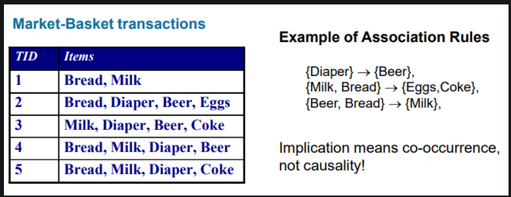
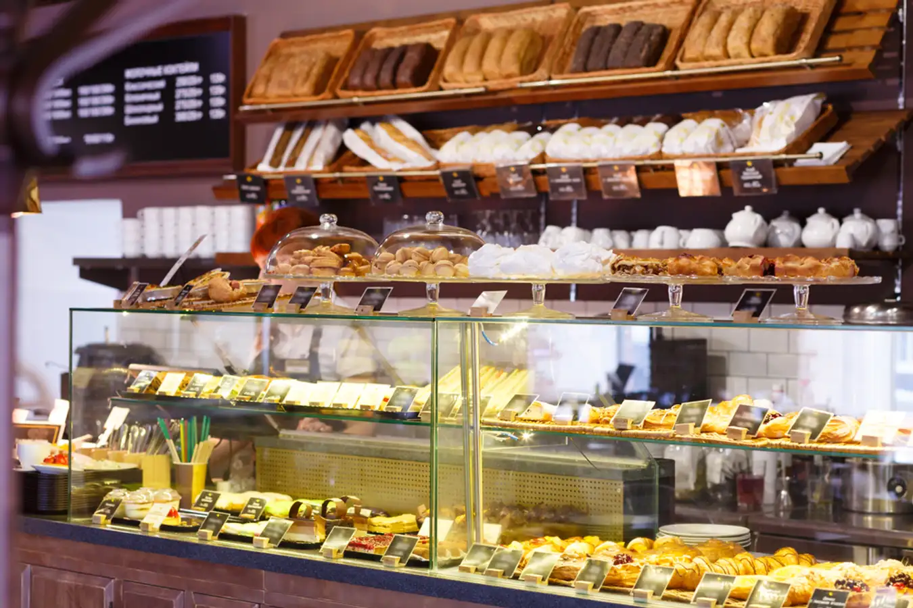
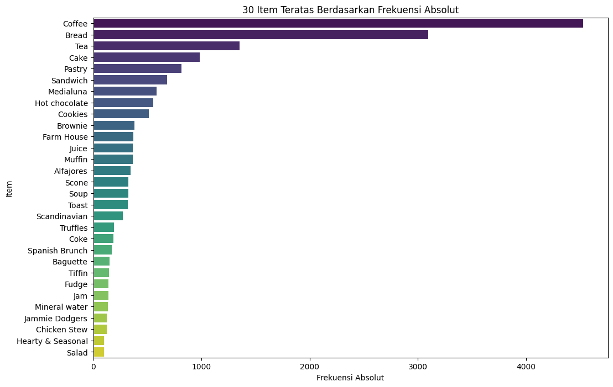
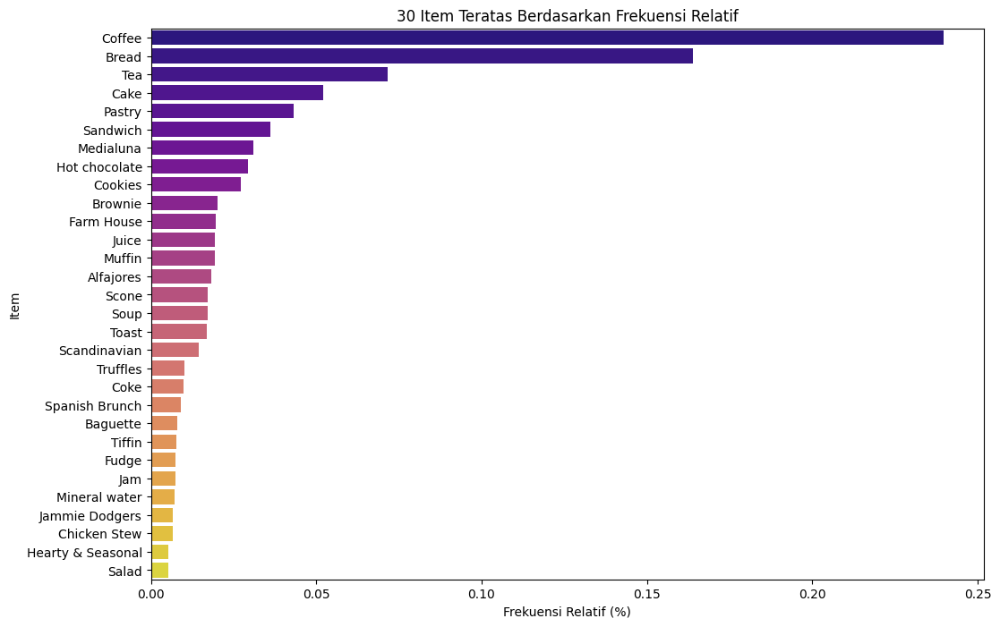

# Association Analysis

## Apa itu Association Mining

- Association rule mining adalah teknik dalam data mining untuk menemukan hubungan yang menarik, pola yang sering terjadi, asosiasi, atau korelasi, antara variabel dalam set data yang besar.
- Banyak digunakan di berbagai bidang seperti market basket analysis, web usage mining, bioinformatika, dan masih banyak lagi.
- Ide dasarnya adalah menemukan aturan yang memprediksi kemunculan suatu item berdasarkan kemunculan item lain dalam transaksi.

Salah satu pemanfaatan Association rule mining yaitu diterapkan pada *Market Basket Analysis*.
Banyak perusahaan bisnis mengumpulkan data dalam jumlah besar dari operasional mereka sehari-hari. Sejumlah besar data pembelian pelanggan dikumpulkan setiap hari.

Menganalisis data untuk mempelajari perilaku pembelian pelanggan mereka. Informasi berharga tersebut dapat digunakan untuk mendukung berbagai hal yang berhubungan dalam peningkatan sebuah bisnis.

**Manfaat :**

- Mengetahui produk apa yang sering dibeli bersamaan oleh pelanggan
- Memprediksi kemunculan suatu item berdasarkan kemunculan item lainnya item dalam transaksi
- Membantu dalam peletakkan barang dalam sebuah toko
- Menentukan produk apa saja yang harus ditawarkan ke pelanggan

## Association Rule Mining

Dalam serangkaian transaksi, menemukan aturan yang akan memprediksi kemunculan suatu item berdasarkan kemunculan item lainnya item dalam transaksi



# Basic dalam Association Rule Mining

**Itemset** Sekumpulan satu atau lebih item.

- Contoh: {Susu, Roti, Popok}

**Frequent itemset** adalah itemset yang muncul dalam dataset dengan frekuensi yang lebih tinggi dari ambang batas yang ditentukan.

---

1. **Support** mengacu pada persentase keranjang(basket) di mana aturan tersebut benar (baik produk di sisi kiri maupun kanan ada).

   - **Frekuensi item dibeli dari semua transaksi**:

   $$
   \text{Support}(X \Rightarrow Y) = \frac{\text{frq}(X, Y)}{N}

   $$
2. **Confidence** mengukur persentase keranjang(basket) yang mengandung produk di sisi kiri juga mengandung produk di sisi kanan.

   - **Seberapa sering item X dan Y muncul bersama berdasarkan jumlah X terjadi (item kiri)**
   - **confidence membantu untuk melihat seberapa valid sebuah aturan**

   $$
   \text{Confidence}(X \Rightarrow Y) = \frac{\text{frq}(X, Y)}{\text{frq}(X)}

   $$
3. **Lift/Korelasi** mengukur seberapa lebih sering item di sisi kiri ditemukan dengan yang di kanan daripada tanpa yang di kanan.

   - **Confidence dari X dan Y dibandingkan dengan frekuensi Y terjadi (item kanan)**
   - **lift membantu untuk melihat seberapa besar ketergantungan antara item dalam aturan tersebut**

   $$
   \text{Lift}(X \Rightarrow Y) = \frac{\text{Support}(X, Y)}{\text{Support}(X) \times \text{Support}(Y)}

   $$

---

# Algorithm untuk Frequent Itemset Mining dan Rule Mining

## 1. Apriori

- Candidate Generation
- Brute Force - (mencoba semua kombinasi yang mungkin)
- Multiple scanning

## 2. FP Growth

- Without Candidate
- Depth First Search - divide and conquer
- Two scanning

# Contoh Implementasi Kasus dengan Apriori Algorithm

## The Bread Basket



- Deskripsi Data:

  - Dataset ini milik "The Bread Basket", sebuah toko roti yang berlokasi di Edinburgh. Dataset memiliki 20.507 entri, lebih dari 9.000 transaksi, dan 4 kolom.
  - Dataset berisi transaksi pelanggan yang memesan berbagai item dari toko roti ini.
  - source: <a href = "https://www.kaggle.com/datasets/mittalvasu95/the-bread-basket"> The bread basket </a>
- Tujuan Analisis:

  - Menemukan pola pembelian pelanggan dari data transaksi pada toko
  - Memberikan rekomendasi produk yang kemungkinan akan dibeli pelanggan
  - Memahami perilaku pembelian pelanggan

```python
import pandas as pd
import seaborn as sns
import matplotlib.pyplot as plt
pd.set_option('display.max_rows', 100)
```

```python
data = pd.read_csv('Bakery.csv')
data
```

<div>
<style scoped>
    .dataframe tbody tr th:only-of-type {
        vertical-align: middle;
    }

.dataframe tbody tr th {
    vertical-align: top;
}

.dataframe thead th {
    text-align: right;
}
</style>
<table border="1" class="dataframe">
  <thead>
    <tr style="text-align: right;">
      <th></th>
      <th>TransactionNo</th>
      <th>Items</th>
      <th>DateTime</th>
      <th>Daypart</th>
      <th>DayType</th>
    </tr>
  </thead>
  <tbody>
    <tr>
      <th>0</th>
      <td>1</td>
      <td>Bread</td>
      <td>2016-10-30 09:58:11</td>
      <td>Morning</td>
      <td>Weekend</td>
    </tr>
    <tr>
      <th>1</th>
      <td>2</td>
      <td>Scandinavian</td>
      <td>2016-10-30 10:05:34</td>
      <td>Morning</td>
      <td>Weekend</td>
    </tr>
    <tr>
      <th>2</th>
      <td>2</td>
      <td>Scandinavian</td>
      <td>2016-10-30 10:05:34</td>
      <td>Morning</td>
      <td>Weekend</td>
    </tr>
    <tr>
      <th>3</th>
      <td>3</td>
      <td>Hot chocolate</td>
      <td>2016-10-30 10:07:57</td>
      <td>Morning</td>
      <td>Weekend</td>
    </tr>
    <tr>
      <th>4</th>
      <td>3</td>
      <td>Jam</td>
      <td>2016-10-30 10:07:57</td>
      <td>Morning</td>
      <td>Weekend</td>
    </tr>
    <tr>
      <th>...</th>
      <td>...</td>
      <td>...</td>
      <td>...</td>
      <td>...</td>
      <td>...</td>
    </tr>
    <tr>
      <th>20502</th>
      <td>9682</td>
      <td>Coffee</td>
      <td>2017-09-04 14:32:58</td>
      <td>Afternoon</td>
      <td>Weekend</td>
    </tr>
    <tr>
      <th>20503</th>
      <td>9682</td>
      <td>Tea</td>
      <td>2017-09-04 14:32:58</td>
      <td>Afternoon</td>
      <td>Weekend</td>
    </tr>
    <tr>
      <th>20504</th>
      <td>9683</td>
      <td>Coffee</td>
      <td>2017-09-04 14:57:06</td>
      <td>Afternoon</td>
      <td>Weekend</td>
    </tr>
    <tr>
      <th>20505</th>
      <td>9683</td>
      <td>Pastry</td>
      <td>2017-09-04 14:57:06</td>
      <td>Afternoon</td>
      <td>Weekend</td>
    </tr>
    <tr>
      <th>20506</th>
      <td>9684</td>
      <td>Smoothies</td>
      <td>2017-09-04 15:04:24</td>
      <td>Afternoon</td>
      <td>Weekend</td>
    </tr>
  </tbody>
</table>
<p>20507 rows × 5 columns</p>
</div>

```python
data
```
<div>
<style scoped>
    .dataframe tbody tr th:only-of-type {
        vertical-align: middle;
    }

.dataframe tbody tr th {
    vertical-align: top;
}

.dataframe thead th {
    text-align: right;
}
</style>
<table border="1" class="dataframe">
  <thead>
    <tr style="text-align: right;">
      <th></th>
      <th>TransactionNo</th>
      <th>Items</th>
      <th>DateTime</th>
      <th>Daypart</th>
      <th>DayType</th>
    </tr>
  </thead>
  <tbody>
    <tr>
      <th>0</th>
      <td>1</td>
      <td>Bread</td>
      <td>2016-10-30 09:58:11</td>
      <td>Morning</td>
      <td>Weekend</td>
    </tr>
    <tr>
      <th>1</th>
      <td>2</td>
      <td>Scandinavian</td>
      <td>2016-10-30 10:05:34</td>
      <td>Morning</td>
      <td>Weekend</td>
    </tr>
    <tr>
      <th>2</th>
      <td>2</td>
      <td>Scandinavian</td>
      <td>2016-10-30 10:05:34</td>
      <td>Morning</td>
      <td>Weekend</td>
    </tr>
    <tr>
      <th>3</th>
      <td>3</td>
      <td>Hot chocolate</td>
      <td>2016-10-30 10:07:57</td>
      <td>Morning</td>
      <td>Weekend</td>
    </tr>
    <tr>
      <th>4</th>
      <td>3</td>
      <td>Jam</td>
      <td>2016-10-30 10:07:57</td>
      <td>Morning</td>
      <td>Weekend</td>
    </tr>
    <tr>
      <th>...</th>
      <td>...</td>
      <td>...</td>
      <td>...</td>
      <td>...</td>
      <td>...</td>
    </tr>
    <tr>
      <th>20502</th>
      <td>9682</td>
      <td>Coffee</td>
      <td>2017-09-04 14:32:58</td>
      <td>Afternoon</td>
      <td>Weekend</td>
    </tr>
    <tr>
      <th>20503</th>
      <td>9682</td>
      <td>Tea</td>
      <td>2017-09-04 14:32:58</td>
      <td>Afternoon</td>
      <td>Weekend</td>
    </tr>
    <tr>
      <th>20504</th>
      <td>9683</td>
      <td>Coffee</td>
      <td>2017-09-04 14:57:06</td>
      <td>Afternoon</td>
      <td>Weekend</td>
    </tr>
    <tr>
      <th>20505</th>
      <td>9683</td>
      <td>Pastry</td>
      <td>2017-09-04 14:57:06</td>
      <td>Afternoon</td>
      <td>Weekend</td>
    </tr>
    <tr>
      <th>20506</th>
      <td>9684</td>
      <td>Smoothies</td>
      <td>2017-09-04 15:04:24</td>
      <td>Afternoon</td>
      <td>Weekend</td>
    </tr>
  </tbody>
</table>
<p>20507 rows × 5 columns</p>
</div>

```python
data.drop_duplicates(inplace = True)
```
Analysis

```python
data.info()
```
<class 'pandas.core.frame.DataFrame'>
Index: 18887 entries, 0 to 20506
Data columns (total 5 columns):
 #   Column         Non-Null Count  Dtype 
---  ------         --------------  ----- 
 0   TransactionNo  18887 non-null  int64 
 1   Items          18887 non-null  object
 2   DateTime       18887 non-null  object
 3   Daypart        18887 non-null  object
 4   DayType        18887 non-null  object
dtypes: int64(1), object(4)
memory usage: 885.3+ KB
```python
data.isnull().sum()
```
TransactionNo    0
Items            0
DateTime         0
Daypart          0
DayType          0
dtype: int64
```python
absolute_freq = data.value_counts('Items').nlargest(30)

# Plot
plt.figure(figsize=(12, 8))
sns.barplot(x=absolute_freq.values, y=absolute_freq.index, palette='viridis')
plt.xlabel('Frekuensi Absolut')
plt.ylabel('Item')
plt.title('30 Item Teratas Berdasarkan Frekuensi Absolut')
plt.show()
```
C:\Users\farha\AppData\Local\Temp\ipykernel_11636\534989139.py:5: FutureWarning: 

Passing `palette` without assigning `hue` is deprecated and will be removed in v0.14.0. Assign the `y` variable to `hue` and set `legend=False` for the same effect.

  sns.barplot(x=absolute_freq.values, y=absolute_freq.index, palette='viridis')


```python
relative_freq = data.value_counts('Items', normalize=True).nlargest(30)

# Plot
plt.figure(figsize=(12, 8))
sns.barplot(x=relative_freq.values, y=relative_freq.index, palette='plasma')
plt.xlabel('Frekuensi Relatif (%)')
plt.ylabel('Item')
plt.title('30 Item Teratas Berdasarkan Frekuensi Relatif')
plt.show()
```
C:\Users\farha\AppData\Local\Temp\ipykernel_11636\4037908831.py:5: FutureWarning: 

Passing `palette` without assigning `hue` is deprecated and will be removed in v0.14.0. Assign the `y` variable to `hue` and set `legend=False` for the same effect.

  sns.barplot(x=relative_freq.values, y=relative_freq.index, palette='plasma')


Processing data

```python
dataset = data.groupby(["TransactionNo"])['Items'].value_counts()
dataset
```
TransactionNo  Items      
1              Bread            1
2              Scandinavian     1
3              Jam              1
               Hot chocolate    1
               Cookies          1
                               ..
9682           Muffin           1
               Coffee           1
9683           Pastry           1
               Coffee           1
9684           Smoothies        1
Name: count, Length: 18887, dtype: int64
```python
dataset_df = dataset.unstack(fill_value=0)
dataset_df.reset_index(inplace=True)
```
```python
dataset_df
```
<div>
<style scoped>
    .dataframe tbody tr th:only-of-type {
        vertical-align: middle;
    }

.dataframe tbody tr th {
    vertical-align: top;
}

.dataframe thead th {
    text-align: right;
}
</style>
<table border="1" class="dataframe">
  <thead>
    <tr style="text-align: right;">
      <th>Items</th>
      <th>TransactionNo</th>
      <th>Adjustment</th>
      <th>Afternoon with the baker</th>
      <th>Alfajores</th>
      <th>Argentina Night</th>
      <th>Art Tray</th>
      <th>Bacon</th>
      <th>Baguette</th>
      <th>Bakewell</th>
      <th>Bare Popcorn</th>
      <th>...</th>
      <th>The BART</th>
      <th>The Nomad</th>
      <th>Tiffin</th>
      <th>Toast</th>
      <th>Truffles</th>
      <th>Tshirt</th>
      <th>Valentine's card</th>
      <th>Vegan Feast</th>
      <th>Vegan mincepie</th>
      <th>Victorian Sponge</th>
    </tr>
  </thead>
  <tbody>
    <tr>
      <th>0</th>
      <td>1</td>
      <td>0</td>
      <td>0</td>
      <td>0</td>
      <td>0</td>
      <td>0</td>
      <td>0</td>
      <td>0</td>
      <td>0</td>
      <td>0</td>
      <td>...</td>
      <td>0</td>
      <td>0</td>
      <td>0</td>
      <td>0</td>
      <td>0</td>
      <td>0</td>
      <td>0</td>
      <td>0</td>
      <td>0</td>
      <td>0</td>
    </tr>
    <tr>
      <th>1</th>
      <td>2</td>
      <td>0</td>
      <td>0</td>
      <td>0</td>
      <td>0</td>
      <td>0</td>
      <td>0</td>
      <td>0</td>
      <td>0</td>
      <td>0</td>
      <td>...</td>
      <td>0</td>
      <td>0</td>
      <td>0</td>
      <td>0</td>
      <td>0</td>
      <td>0</td>
      <td>0</td>
      <td>0</td>
      <td>0</td>
      <td>0</td>
    </tr>
    <tr>
      <th>2</th>
      <td>3</td>
      <td>0</td>
      <td>0</td>
      <td>0</td>
      <td>0</td>
      <td>0</td>
      <td>0</td>
      <td>0</td>
      <td>0</td>
      <td>0</td>
      <td>...</td>
      <td>0</td>
      <td>0</td>
      <td>0</td>
      <td>0</td>
      <td>0</td>
      <td>0</td>
      <td>0</td>
      <td>0</td>
      <td>0</td>
      <td>0</td>
    </tr>
    <tr>
      <th>3</th>
      <td>4</td>
      <td>0</td>
      <td>0</td>
      <td>0</td>
      <td>0</td>
      <td>0</td>
      <td>0</td>
      <td>0</td>
      <td>0</td>
      <td>0</td>
      <td>...</td>
      <td>0</td>
      <td>0</td>
      <td>0</td>
      <td>0</td>
      <td>0</td>
      <td>0</td>
      <td>0</td>
      <td>0</td>
      <td>0</td>
      <td>0</td>
    </tr>
    <tr>
      <th>4</th>
      <td>5</td>
      <td>0</td>
      <td>0</td>
      <td>0</td>
      <td>0</td>
      <td>0</td>
      <td>0</td>
      <td>0</td>
      <td>0</td>
      <td>0</td>
      <td>...</td>
      <td>0</td>
      <td>0</td>
      <td>0</td>
      <td>0</td>
      <td>0</td>
      <td>0</td>
      <td>0</td>
      <td>0</td>
      <td>0</td>
      <td>0</td>
    </tr>
    <tr>
      <th>...</th>
      <td>...</td>
      <td>...</td>
      <td>...</td>
      <td>...</td>
      <td>...</td>
      <td>...</td>
      <td>...</td>
      <td>...</td>
      <td>...</td>
      <td>...</td>
      <td>...</td>
      <td>...</td>
      <td>...</td>
      <td>...</td>
      <td>...</td>
      <td>...</td>
      <td>...</td>
      <td>...</td>
      <td>...</td>
      <td>...</td>
      <td>...</td>
    </tr>
    <tr>
      <th>9460</th>
      <td>9680</td>
      <td>0</td>
      <td>0</td>
      <td>0</td>
      <td>0</td>
      <td>0</td>
      <td>0</td>
      <td>0</td>
      <td>0</td>
      <td>0</td>
      <td>...</td>
      <td>0</td>
      <td>0</td>
      <td>0</td>
      <td>0</td>
      <td>0</td>
      <td>0</td>
      <td>0</td>
      <td>0</td>
      <td>0</td>
      <td>0</td>
    </tr>
    <tr>
      <th>9461</th>
      <td>9681</td>
      <td>0</td>
      <td>0</td>
      <td>0</td>
      <td>0</td>
      <td>0</td>
      <td>0</td>
      <td>0</td>
      <td>0</td>
      <td>0</td>
      <td>...</td>
      <td>0</td>
      <td>0</td>
      <td>0</td>
      <td>0</td>
      <td>1</td>
      <td>0</td>
      <td>0</td>
      <td>0</td>
      <td>0</td>
      <td>0</td>
    </tr>
    <tr>
      <th>9462</th>
      <td>9682</td>
      <td>0</td>
      <td>0</td>
      <td>0</td>
      <td>0</td>
      <td>0</td>
      <td>0</td>
      <td>0</td>
      <td>0</td>
      <td>0</td>
      <td>...</td>
      <td>0</td>
      <td>0</td>
      <td>0</td>
      <td>0</td>
      <td>0</td>
      <td>0</td>
      <td>0</td>
      <td>0</td>
      <td>0</td>
      <td>0</td>
    </tr>
    <tr>
      <th>9463</th>
      <td>9683</td>
      <td>0</td>
      <td>0</td>
      <td>0</td>
      <td>0</td>
      <td>0</td>
      <td>0</td>
      <td>0</td>
      <td>0</td>
      <td>0</td>
      <td>...</td>
      <td>0</td>
      <td>0</td>
      <td>0</td>
      <td>0</td>
      <td>0</td>
      <td>0</td>
      <td>0</td>
      <td>0</td>
      <td>0</td>
      <td>0</td>
    </tr>
    <tr>
      <th>9464</th>
      <td>9684</td>
      <td>0</td>
      <td>0</td>
      <td>0</td>
      <td>0</td>
      <td>0</td>
      <td>0</td>
      <td>0</td>
      <td>0</td>
      <td>0</td>
      <td>...</td>
      <td>0</td>
      <td>0</td>
      <td>0</td>
      <td>0</td>
      <td>0</td>
      <td>0</td>
      <td>0</td>
      <td>0</td>
      <td>0</td>
      <td>0</td>
    </tr>
  </tbody>
</table>
<p>9465 rows × 95 columns</p>
</div>

```python
dataset_df = dataset_df.drop(columns = ['TransactionNo']).copy()
dataset_df
```
<div>
<style scoped>
    .dataframe tbody tr th:only-of-type {
        vertical-align: middle;
    }

.dataframe tbody tr th {
    vertical-align: top;
}

.dataframe thead th {
    text-align: right;
}
</style>
<table border="1" class="dataframe">
  <thead>
    <tr style="text-align: right;">
      <th>Items</th>
      <th>Adjustment</th>
      <th>Afternoon with the baker</th>
      <th>Alfajores</th>
      <th>Argentina Night</th>
      <th>Art Tray</th>
      <th>Bacon</th>
      <th>Baguette</th>
      <th>Bakewell</th>
      <th>Bare Popcorn</th>
      <th>Basket</th>
      <th>...</th>
      <th>The BART</th>
      <th>The Nomad</th>
      <th>Tiffin</th>
      <th>Toast</th>
      <th>Truffles</th>
      <th>Tshirt</th>
      <th>Valentine's card</th>
      <th>Vegan Feast</th>
      <th>Vegan mincepie</th>
      <th>Victorian Sponge</th>
    </tr>
  </thead>
  <tbody>
    <tr>
      <th>0</th>
      <td>0</td>
      <td>0</td>
      <td>0</td>
      <td>0</td>
      <td>0</td>
      <td>0</td>
      <td>0</td>
      <td>0</td>
      <td>0</td>
      <td>0</td>
      <td>...</td>
      <td>0</td>
      <td>0</td>
      <td>0</td>
      <td>0</td>
      <td>0</td>
      <td>0</td>
      <td>0</td>
      <td>0</td>
      <td>0</td>
      <td>0</td>
    </tr>
    <tr>
      <th>1</th>
      <td>0</td>
      <td>0</td>
      <td>0</td>
      <td>0</td>
      <td>0</td>
      <td>0</td>
      <td>0</td>
      <td>0</td>
      <td>0</td>
      <td>0</td>
      <td>...</td>
      <td>0</td>
      <td>0</td>
      <td>0</td>
      <td>0</td>
      <td>0</td>
      <td>0</td>
      <td>0</td>
      <td>0</td>
      <td>0</td>
      <td>0</td>
    </tr>
    <tr>
      <th>2</th>
      <td>0</td>
      <td>0</td>
      <td>0</td>
      <td>0</td>
      <td>0</td>
      <td>0</td>
      <td>0</td>
      <td>0</td>
      <td>0</td>
      <td>0</td>
      <td>...</td>
      <td>0</td>
      <td>0</td>
      <td>0</td>
      <td>0</td>
      <td>0</td>
      <td>0</td>
      <td>0</td>
      <td>0</td>
      <td>0</td>
      <td>0</td>
    </tr>
    <tr>
      <th>3</th>
      <td>0</td>
      <td>0</td>
      <td>0</td>
      <td>0</td>
      <td>0</td>
      <td>0</td>
      <td>0</td>
      <td>0</td>
      <td>0</td>
      <td>0</td>
      <td>...</td>
      <td>0</td>
      <td>0</td>
      <td>0</td>
      <td>0</td>
      <td>0</td>
      <td>0</td>
      <td>0</td>
      <td>0</td>
      <td>0</td>
      <td>0</td>
    </tr>
    <tr>
      <th>4</th>
      <td>0</td>
      <td>0</td>
      <td>0</td>
      <td>0</td>
      <td>0</td>
      <td>0</td>
      <td>0</td>
      <td>0</td>
      <td>0</td>
      <td>0</td>
      <td>...</td>
      <td>0</td>
      <td>0</td>
      <td>0</td>
      <td>0</td>
      <td>0</td>
      <td>0</td>
      <td>0</td>
      <td>0</td>
      <td>0</td>
      <td>0</td>
    </tr>
    <tr>
      <th>...</th>
      <td>...</td>
      <td>...</td>
      <td>...</td>
      <td>...</td>
      <td>...</td>
      <td>...</td>
      <td>...</td>
      <td>...</td>
      <td>...</td>
      <td>...</td>
      <td>...</td>
      <td>...</td>
      <td>...</td>
      <td>...</td>
      <td>...</td>
      <td>...</td>
      <td>...</td>
      <td>...</td>
      <td>...</td>
      <td>...</td>
      <td>...</td>
    </tr>
    <tr>
      <th>9460</th>
      <td>0</td>
      <td>0</td>
      <td>0</td>
      <td>0</td>
      <td>0</td>
      <td>0</td>
      <td>0</td>
      <td>0</td>
      <td>0</td>
      <td>0</td>
      <td>...</td>
      <td>0</td>
      <td>0</td>
      <td>0</td>
      <td>0</td>
      <td>0</td>
      <td>0</td>
      <td>0</td>
      <td>0</td>
      <td>0</td>
      <td>0</td>
    </tr>
    <tr>
      <th>9461</th>
      <td>0</td>
      <td>0</td>
      <td>0</td>
      <td>0</td>
      <td>0</td>
      <td>0</td>
      <td>0</td>
      <td>0</td>
      <td>0</td>
      <td>0</td>
      <td>...</td>
      <td>0</td>
      <td>0</td>
      <td>0</td>
      <td>0</td>
      <td>1</td>
      <td>0</td>
      <td>0</td>
      <td>0</td>
      <td>0</td>
      <td>0</td>
    </tr>
    <tr>
      <th>9462</th>
      <td>0</td>
      <td>0</td>
      <td>0</td>
      <td>0</td>
      <td>0</td>
      <td>0</td>
      <td>0</td>
      <td>0</td>
      <td>0</td>
      <td>0</td>
      <td>...</td>
      <td>0</td>
      <td>0</td>
      <td>0</td>
      <td>0</td>
      <td>0</td>
      <td>0</td>
      <td>0</td>
      <td>0</td>
      <td>0</td>
      <td>0</td>
    </tr>
    <tr>
      <th>9463</th>
      <td>0</td>
      <td>0</td>
      <td>0</td>
      <td>0</td>
      <td>0</td>
      <td>0</td>
      <td>0</td>
      <td>0</td>
      <td>0</td>
      <td>0</td>
      <td>...</td>
      <td>0</td>
      <td>0</td>
      <td>0</td>
      <td>0</td>
      <td>0</td>
      <td>0</td>
      <td>0</td>
      <td>0</td>
      <td>0</td>
      <td>0</td>
    </tr>
    <tr>
      <th>9464</th>
      <td>0</td>
      <td>0</td>
      <td>0</td>
      <td>0</td>
      <td>0</td>
      <td>0</td>
      <td>0</td>
      <td>0</td>
      <td>0</td>
      <td>0</td>
      <td>...</td>
      <td>0</td>
      <td>0</td>
      <td>0</td>
      <td>0</td>
      <td>0</td>
      <td>0</td>
      <td>0</td>
      <td>0</td>
      <td>0</td>
      <td>0</td>
    </tr>
  </tbody>
</table>
<p>9465 rows × 94 columns</p>
</div>

```python
# Encoding data antara 1 atau 0
def encode_units(x):
    return 1 if x >= 1 else 0

dataset_df = dataset_df.applymap(encode_units)
```
C:\Users\farha\AppData\Local\Temp\ipykernel_11636\4202604384.py:5: FutureWarning: DataFrame.applymap has been deprecated. Use DataFrame.map instead.
  dataset_df = dataset_df.applymap(encode_units)
## Tahapan Apriori Algorithm

## Step 1 - Mining Frequent Itemsets

Penyelesaain dengan pendekatan brute force men-traverse semua kemungkinan itemsets, mencari **supportnya** dan mengeleminasi/prune infrequent itemset

support tiap kandidat 1 item set

```python
for n in dataset_df.columns:
    print(n, ":", len(dataset_df[dataset_df[n] == 1]) / len(dataset_df))
```
Adjustment : 0.00010565240359218173
Afternoon with the baker : 0.004543053354463814
Alfajores : 0.036344426835710514
Argentina Night : 0.0007395668251452721
Art Tray : 0.004014791336502906
Bacon : 0.00010565240359218173
Baguette : 0.016059165346011622
Bakewell : 0.005071315372424723
Bare Popcorn : 0.0005282620179609086
Basket : 0.0006339144215530904
Bowl Nic Pitt : 0.00021130480718436345
Bread : 0.32720549392498677
Bread Pudding : 0.0004226096143687269
Brioche and salami : 0.0003169572107765452
Brownie : 0.04004226096143687
Cake : 0.10385631273111463
Caramel bites : 0.0003169572107765452
Cherry me Dried fruit : 0.0003169572107765452
Chicken Stew : 0.012995245641838352
Chicken sand : 0.00010565240359218173
Chimichurri Oil : 0.00021130480718436345
Chocolates : 0.0009508716323296355
Christmas common : 0.001162176439513999
Coffee : 0.47839408346539886
Coffee granules  : 0.0007395668251452721
Coke : 0.019440042260961438
Cookies : 0.054410987849973586
Crepes : 0.0006339144215530904
Crisps : 0.0014791336502905442
Drinking chocolate spoons  : 0.0008452192287374538
Duck egg : 0.0012678288431061807
Dulce de Leche : 0.0013734812466983624
Eggs : 0.0029582673005810883
Ella's Kitchen Pouches : 0.0017960908610670893
Empanadas : 0.0007395668251452721
Extra Salami or Feta : 0.004014791336502906
Fairy Doors : 0.00021130480718436345
Farm House : 0.03919704173269942
Focaccia : 0.005705229793977813
Frittata : 0.00855784469096672
Fudge : 0.015002641310089805
Gift voucher : 0.00010565240359218173
Gingerbread syrup : 0.0009508716323296355
Granola : 0.0029582673005810883
Hack the stack : 0.00021130480718436345
Half slice Monster  : 0.0006339144215530904
Hearty & Seasonal : 0.010565240359218173
Honey : 0.0006339144215530904
Hot chocolate : 0.05832012678288431
Jam : 0.015002641310089805
Jammie Dodgers : 0.013206550449022716
Juice : 0.03856312731114633
Keeping It Local : 0.006656101426307449
Kids biscuit : 0.0012678288431061807
Lemon and coconut : 0.0006339144215530904
Medialuna : 0.061806656101426306
Mighty Protein : 0.001162176439513999
Mineral water : 0.014157422081352351
Mortimer : 0.0005282620179609086
Muesli : 0.0008452192287374538
Muffin : 0.03845747490755415
My-5 Fruit Shoot : 0.001901743264659271
Nomad bag : 0.0008452192287374538
Olum & polenta : 0.00010565240359218173
Panatone : 0.0005282620179609086
Pastry : 0.0861067089276281
Pick and Mix Bowls : 0.0012678288431061807
Pintxos : 0.0006339144215530904
Polenta : 0.00010565240359218173
Postcard : 0.0010565240359218173
Raspberry shortbread sandwich : 0.0003169572107765452
Raw bars : 0.00010565240359218173
Salad : 0.010459587955625991
Sandwich : 0.07184363444268357
Scandinavian : 0.029054410987849975
Scone : 0.03454833597464342
Siblings : 0.00021130480718436345
Smoothies : 0.008135235076597993
Soup : 0.03444268357105124
Spanish Brunch : 0.018172213417855257
Spread : 0.00021130480718436345
Tacos/Fajita : 0.001162176439513999
Tartine : 0.004860010565240359
Tea : 0.14263074484944532
The BART : 0.00010565240359218173
The Nomad : 0.00612783940834654
Tiffin : 0.015425250924458532
Toast : 0.03359746434231379
Truffles : 0.02028526148969889
Tshirt : 0.0022187004754358162
Valentine's card : 0.0013734812466983624
Vegan Feast : 0.0016904384574749076
Vegan mincepie : 0.00549392498679345
Victorian Sponge : 0.0007395668251452721
Jumlah tiap item support

```python
for n in dataset_df.columns:
    print(n, ":", len(dataset_df[dataset_df[n] == 1]))
```
Adjustment : 1
Afternoon with the baker : 43
Alfajores : 344
Argentina Night : 7
Art Tray : 38
Bacon : 1
Baguette : 152
Bakewell : 48
Bare Popcorn : 5
Basket : 6
Bowl Nic Pitt : 2
Bread : 3097
Bread Pudding : 4
Brioche and salami : 3
Brownie : 379
Cake : 983
Caramel bites : 3
Cherry me Dried fruit : 3
Chicken Stew : 123
Chicken sand : 1
Chimichurri Oil : 2
Chocolates : 9
Christmas common : 11
Coffee : 4528
Coffee granules  : 7
Coke : 184
Cookies : 515
Crepes : 6
Crisps : 14
Drinking chocolate spoons  : 8
Duck egg : 12
Dulce de Leche : 13
Eggs : 28
Ella's Kitchen Pouches : 17
Empanadas : 7
Extra Salami or Feta : 38
Fairy Doors : 2
Farm House : 371
Focaccia : 54
Frittata : 81
Fudge : 142
Gift voucher : 1
Gingerbread syrup : 9
Granola : 28
Hack the stack : 2
Half slice Monster  : 6
Hearty & Seasonal : 100
Honey : 6
Hot chocolate : 552
Jam : 142
Jammie Dodgers : 125
Juice : 365
Keeping It Local : 63
Kids biscuit : 12
Lemon and coconut : 6
Medialuna : 585
Mighty Protein : 11
Mineral water : 134
Mortimer : 5
Muesli : 8
Muffin : 364
My-5 Fruit Shoot : 18
Nomad bag : 8
Olum & polenta : 1
Panatone : 5
Pastry : 815
Pick and Mix Bowls : 12
Pintxos : 6
Polenta : 1
Postcard : 10
Raspberry shortbread sandwich : 3
Raw bars : 1
Salad : 99
Sandwich : 680
Scandinavian : 275
Scone : 327
Siblings : 2
Smoothies : 77
Soup : 326
Spanish Brunch : 172
Spread : 2
Tacos/Fajita : 11
Tartine : 46
Tea : 1350
The BART : 1
The Nomad : 58
Tiffin : 146
Toast : 318
Truffles : 192
Tshirt : 21
Valentine's card : 13
Vegan Feast : 16
Vegan mincepie : 52
Victorian Sponge : 7
kemudian  prune kandidat 1 itemset dengan minimum support 0.01

```python
itemset_terpilih = []
kandidat1 = []
for n in dataset_df.columns:
    support  = len(dataset_df[dataset_df[n] == 1]) / len(dataset_df)
  
    if support >=  0.01:
        kandidat1.append(n)
        itemset_terpilih.append({"itemset" : n, 
                                 "Support":support})
        print(n,":",support)
```
Alfajores : 0.036344426835710514
Baguette : 0.016059165346011622
Bread : 0.32720549392498677
Brownie : 0.04004226096143687
Cake : 0.10385631273111463
Chicken Stew : 0.012995245641838352
Coffee : 0.47839408346539886
Coke : 0.019440042260961438
Cookies : 0.054410987849973586
Farm House : 0.03919704173269942
Fudge : 0.015002641310089805
Hearty & Seasonal : 0.010565240359218173
Hot chocolate : 0.05832012678288431
Jam : 0.015002641310089805
Jammie Dodgers : 0.013206550449022716
Juice : 0.03856312731114633
Medialuna : 0.061806656101426306
Mineral water : 0.014157422081352351
Muffin : 0.03845747490755415
Pastry : 0.0861067089276281
Salad : 0.010459587955625991
Sandwich : 0.07184363444268357
Scandinavian : 0.029054410987849975
Scone : 0.03454833597464342
Soup : 0.03444268357105124
Spanish Brunch : 0.018172213417855257
Tea : 0.14263074484944532
Tiffin : 0.015425250924458532
Toast : 0.03359746434231379
Truffles : 0.02028526148969889
Frequent item set  untuk kandidat dua itemset bedasarkan item set kandidat 1

```python
# Semua kemungkinan kombinasi 2 itemset dari kandidat 1

from itertools import combinations
comb_2_items = list(combinations(kandidat1, 2))
len(comb_2_items)
```
435
```python
comb_2_items
```
[('Alfajores', 'Baguette'),
 ('Alfajores', 'Bread'),
 ('Alfajores', 'Brownie'),
 ('Alfajores', 'Cake'),
 ('Alfajores', 'Chicken Stew'),
 ('Alfajores', 'Coffee'),
 ('Alfajores', 'Coke'),
 ('Alfajores', 'Cookies'),
 ('Alfajores', 'Farm House'),
 ('Alfajores', 'Fudge'),
 ('Alfajores', 'Hearty & Seasonal'),
 ('Alfajores', 'Hot chocolate'),
 ('Alfajores', 'Jam'),
 ('Alfajores', 'Jammie Dodgers'),
 ('Alfajores', 'Juice'),
 ('Alfajores', 'Medialuna'),
 ('Alfajores', 'Mineral water'),
 ('Alfajores', 'Muffin'),
 ('Alfajores', 'Pastry'),
 ('Alfajores', 'Salad'),
 ('Alfajores', 'Sandwich'),
 ('Alfajores', 'Scandinavian'),
 ('Alfajores', 'Scone'),
 ('Alfajores', 'Soup'),
 ('Alfajores', 'Spanish Brunch'),
 ('Alfajores', 'Tea'),
 ('Alfajores', 'Tiffin'),
 ('Alfajores', 'Toast'),
 ('Alfajores', 'Truffles'),
 ('Baguette', 'Bread'),
 ('Baguette', 'Brownie'),
 ('Baguette', 'Cake'),
 ('Baguette', 'Chicken Stew'),
 ('Baguette', 'Coffee'),
 ('Baguette', 'Coke'),
 ('Baguette', 'Cookies'),
 ('Baguette', 'Farm House'),
 ('Baguette', 'Fudge'),
 ('Baguette', 'Hearty & Seasonal'),
 ('Baguette', 'Hot chocolate'),
 ('Baguette', 'Jam'),
 ('Baguette', 'Jammie Dodgers'),
 ('Baguette', 'Juice'),
 ('Baguette', 'Medialuna'),
 ('Baguette', 'Mineral water'),
 ('Baguette', 'Muffin'),
 ('Baguette', 'Pastry'),
 ('Baguette', 'Salad'),
 ('Baguette', 'Sandwich'),
 ('Baguette', 'Scandinavian'),
 ('Baguette', 'Scone'),
 ('Baguette', 'Soup'),
 ('Baguette', 'Spanish Brunch'),
 ('Baguette', 'Tea'),
 ('Baguette', 'Tiffin'),
 ('Baguette', 'Toast'),
 ('Baguette', 'Truffles'),
 ('Bread', 'Brownie'),
 ('Bread', 'Cake'),
 ('Bread', 'Chicken Stew'),
 ('Bread', 'Coffee'),
 ('Bread', 'Coke'),
 ('Bread', 'Cookies'),
 ('Bread', 'Farm House'),
 ('Bread', 'Fudge'),
 ('Bread', 'Hearty & Seasonal'),
 ('Bread', 'Hot chocolate'),
 ('Bread', 'Jam'),
 ('Bread', 'Jammie Dodgers'),
 ('Bread', 'Juice'),
 ('Bread', 'Medialuna'),
 ('Bread', 'Mineral water'),
 ('Bread', 'Muffin'),
 ('Bread', 'Pastry'),
 ('Bread', 'Salad'),
 ('Bread', 'Sandwich'),
 ('Bread', 'Scandinavian'),
 ('Bread', 'Scone'),
 ('Bread', 'Soup'),
 ('Bread', 'Spanish Brunch'),
 ('Bread', 'Tea'),
 ('Bread', 'Tiffin'),
 ('Bread', 'Toast'),
 ('Bread', 'Truffles'),
 ('Brownie', 'Cake'),
 ('Brownie', 'Chicken Stew'),
 ('Brownie', 'Coffee'),
 ('Brownie', 'Coke'),
 ('Brownie', 'Cookies'),
 ('Brownie', 'Farm House'),
 ('Brownie', 'Fudge'),
 ('Brownie', 'Hearty & Seasonal'),
 ('Brownie', 'Hot chocolate'),
 ('Brownie', 'Jam'),
 ('Brownie', 'Jammie Dodgers'),
 ('Brownie', 'Juice'),
 ('Brownie', 'Medialuna'),
 ('Brownie', 'Mineral water'),
 ('Brownie', 'Muffin'),
 ('Brownie', 'Pastry'),
 ('Brownie', 'Salad'),
 ('Brownie', 'Sandwich'),
 ('Brownie', 'Scandinavian'),
 ('Brownie', 'Scone'),
 ('Brownie', 'Soup'),
 ('Brownie', 'Spanish Brunch'),
 ('Brownie', 'Tea'),
 ('Brownie', 'Tiffin'),
 ('Brownie', 'Toast'),
 ('Brownie', 'Truffles'),
 ('Cake', 'Chicken Stew'),
 ('Cake', 'Coffee'),
 ('Cake', 'Coke'),
 ('Cake', 'Cookies'),
 ('Cake', 'Farm House'),
 ('Cake', 'Fudge'),
 ('Cake', 'Hearty & Seasonal'),
 ('Cake', 'Hot chocolate'),
 ('Cake', 'Jam'),
 ('Cake', 'Jammie Dodgers'),
 ('Cake', 'Juice'),
 ('Cake', 'Medialuna'),
 ('Cake', 'Mineral water'),
 ('Cake', 'Muffin'),
 ('Cake', 'Pastry'),
 ('Cake', 'Salad'),
 ('Cake', 'Sandwich'),
 ('Cake', 'Scandinavian'),
 ('Cake', 'Scone'),
 ('Cake', 'Soup'),
 ('Cake', 'Spanish Brunch'),
 ('Cake', 'Tea'),
 ('Cake', 'Tiffin'),
 ('Cake', 'Toast'),
 ('Cake', 'Truffles'),
 ('Chicken Stew', 'Coffee'),
 ('Chicken Stew', 'Coke'),
 ('Chicken Stew', 'Cookies'),
 ('Chicken Stew', 'Farm House'),
 ('Chicken Stew', 'Fudge'),
 ('Chicken Stew', 'Hearty & Seasonal'),
 ('Chicken Stew', 'Hot chocolate'),
 ('Chicken Stew', 'Jam'),
 ('Chicken Stew', 'Jammie Dodgers'),
 ('Chicken Stew', 'Juice'),
 ('Chicken Stew', 'Medialuna'),
 ('Chicken Stew', 'Mineral water'),
 ('Chicken Stew', 'Muffin'),
 ('Chicken Stew', 'Pastry'),
 ('Chicken Stew', 'Salad'),
 ('Chicken Stew', 'Sandwich'),
 ('Chicken Stew', 'Scandinavian'),
 ('Chicken Stew', 'Scone'),
 ('Chicken Stew', 'Soup'),
 ('Chicken Stew', 'Spanish Brunch'),
 ('Chicken Stew', 'Tea'),
 ('Chicken Stew', 'Tiffin'),
 ('Chicken Stew', 'Toast'),
 ('Chicken Stew', 'Truffles'),
 ('Coffee', 'Coke'),
 ('Coffee', 'Cookies'),
 ('Coffee', 'Farm House'),
 ('Coffee', 'Fudge'),
 ('Coffee', 'Hearty & Seasonal'),
 ('Coffee', 'Hot chocolate'),
 ('Coffee', 'Jam'),
 ('Coffee', 'Jammie Dodgers'),
 ('Coffee', 'Juice'),
 ('Coffee', 'Medialuna'),
 ('Coffee', 'Mineral water'),
 ('Coffee', 'Muffin'),
 ('Coffee', 'Pastry'),
 ('Coffee', 'Salad'),
 ('Coffee', 'Sandwich'),
 ('Coffee', 'Scandinavian'),
 ('Coffee', 'Scone'),
 ('Coffee', 'Soup'),
 ('Coffee', 'Spanish Brunch'),
 ('Coffee', 'Tea'),
 ('Coffee', 'Tiffin'),
 ('Coffee', 'Toast'),
 ('Coffee', 'Truffles'),
 ('Coke', 'Cookies'),
 ('Coke', 'Farm House'),
 ('Coke', 'Fudge'),
 ('Coke', 'Hearty & Seasonal'),
 ('Coke', 'Hot chocolate'),
 ('Coke', 'Jam'),
 ('Coke', 'Jammie Dodgers'),
 ('Coke', 'Juice'),
 ('Coke', 'Medialuna'),
 ('Coke', 'Mineral water'),
 ('Coke', 'Muffin'),
 ('Coke', 'Pastry'),
 ('Coke', 'Salad'),
 ('Coke', 'Sandwich'),
 ('Coke', 'Scandinavian'),
 ('Coke', 'Scone'),
 ('Coke', 'Soup'),
 ('Coke', 'Spanish Brunch'),
 ('Coke', 'Tea'),
 ('Coke', 'Tiffin'),
 ('Coke', 'Toast'),
 ('Coke', 'Truffles'),
 ('Cookies', 'Farm House'),
 ('Cookies', 'Fudge'),
 ('Cookies', 'Hearty & Seasonal'),
 ('Cookies', 'Hot chocolate'),
 ('Cookies', 'Jam'),
 ('Cookies', 'Jammie Dodgers'),
 ('Cookies', 'Juice'),
 ('Cookies', 'Medialuna'),
 ('Cookies', 'Mineral water'),
 ('Cookies', 'Muffin'),
 ('Cookies', 'Pastry'),
 ('Cookies', 'Salad'),
 ('Cookies', 'Sandwich'),
 ('Cookies', 'Scandinavian'),
 ('Cookies', 'Scone'),
 ('Cookies', 'Soup'),
 ('Cookies', 'Spanish Brunch'),
 ('Cookies', 'Tea'),
 ('Cookies', 'Tiffin'),
 ('Cookies', 'Toast'),
 ('Cookies', 'Truffles'),
 ('Farm House', 'Fudge'),
 ('Farm House', 'Hearty & Seasonal'),
 ('Farm House', 'Hot chocolate'),
 ('Farm House', 'Jam'),
 ('Farm House', 'Jammie Dodgers'),
 ('Farm House', 'Juice'),
 ('Farm House', 'Medialuna'),
 ('Farm House', 'Mineral water'),
 ('Farm House', 'Muffin'),
 ('Farm House', 'Pastry'),
 ('Farm House', 'Salad'),
 ('Farm House', 'Sandwich'),
 ('Farm House', 'Scandinavian'),
 ('Farm House', 'Scone'),
 ('Farm House', 'Soup'),
 ('Farm House', 'Spanish Brunch'),
 ('Farm House', 'Tea'),
 ('Farm House', 'Tiffin'),
 ('Farm House', 'Toast'),
 ('Farm House', 'Truffles'),
 ('Fudge', 'Hearty & Seasonal'),
 ('Fudge', 'Hot chocolate'),
 ('Fudge', 'Jam'),
 ('Fudge', 'Jammie Dodgers'),
 ('Fudge', 'Juice'),
 ('Fudge', 'Medialuna'),
 ('Fudge', 'Mineral water'),
 ('Fudge', 'Muffin'),
 ('Fudge', 'Pastry'),
 ('Fudge', 'Salad'),
 ('Fudge', 'Sandwich'),
 ('Fudge', 'Scandinavian'),
 ('Fudge', 'Scone'),
 ('Fudge', 'Soup'),
 ('Fudge', 'Spanish Brunch'),
 ('Fudge', 'Tea'),
 ('Fudge', 'Tiffin'),
 ('Fudge', 'Toast'),
 ('Fudge', 'Truffles'),
 ('Hearty & Seasonal', 'Hot chocolate'),
 ('Hearty & Seasonal', 'Jam'),
 ('Hearty & Seasonal', 'Jammie Dodgers'),
 ('Hearty & Seasonal', 'Juice'),
 ('Hearty & Seasonal', 'Medialuna'),
 ('Hearty & Seasonal', 'Mineral water'),
 ('Hearty & Seasonal', 'Muffin'),
 ('Hearty & Seasonal', 'Pastry'),
 ('Hearty & Seasonal', 'Salad'),
 ('Hearty & Seasonal', 'Sandwich'),
 ('Hearty & Seasonal', 'Scandinavian'),
 ('Hearty & Seasonal', 'Scone'),
 ('Hearty & Seasonal', 'Soup'),
 ('Hearty & Seasonal', 'Spanish Brunch'),
 ('Hearty & Seasonal', 'Tea'),
 ('Hearty & Seasonal', 'Tiffin'),
 ('Hearty & Seasonal', 'Toast'),
 ('Hearty & Seasonal', 'Truffles'),
 ('Hot chocolate', 'Jam'),
 ('Hot chocolate', 'Jammie Dodgers'),
 ('Hot chocolate', 'Juice'),
 ('Hot chocolate', 'Medialuna'),
 ('Hot chocolate', 'Mineral water'),
 ('Hot chocolate', 'Muffin'),
 ('Hot chocolate', 'Pastry'),
 ('Hot chocolate', 'Salad'),
 ('Hot chocolate', 'Sandwich'),
 ('Hot chocolate', 'Scandinavian'),
 ('Hot chocolate', 'Scone'),
 ('Hot chocolate', 'Soup'),
 ('Hot chocolate', 'Spanish Brunch'),
 ('Hot chocolate', 'Tea'),
 ('Hot chocolate', 'Tiffin'),
 ('Hot chocolate', 'Toast'),
 ('Hot chocolate', 'Truffles'),
 ('Jam', 'Jammie Dodgers'),
 ('Jam', 'Juice'),
 ('Jam', 'Medialuna'),
 ('Jam', 'Mineral water'),
 ('Jam', 'Muffin'),
 ('Jam', 'Pastry'),
 ('Jam', 'Salad'),
 ('Jam', 'Sandwich'),
 ('Jam', 'Scandinavian'),
 ('Jam', 'Scone'),
 ('Jam', 'Soup'),
 ('Jam', 'Spanish Brunch'),
 ('Jam', 'Tea'),
 ('Jam', 'Tiffin'),
 ('Jam', 'Toast'),
 ('Jam', 'Truffles'),
 ('Jammie Dodgers', 'Juice'),
 ('Jammie Dodgers', 'Medialuna'),
 ('Jammie Dodgers', 'Mineral water'),
 ('Jammie Dodgers', 'Muffin'),
 ('Jammie Dodgers', 'Pastry'),
 ('Jammie Dodgers', 'Salad'),
 ('Jammie Dodgers', 'Sandwich'),
 ('Jammie Dodgers', 'Scandinavian'),
 ('Jammie Dodgers', 'Scone'),
 ('Jammie Dodgers', 'Soup'),
 ('Jammie Dodgers', 'Spanish Brunch'),
 ('Jammie Dodgers', 'Tea'),
 ('Jammie Dodgers', 'Tiffin'),
 ('Jammie Dodgers', 'Toast'),
 ('Jammie Dodgers', 'Truffles'),
 ('Juice', 'Medialuna'),
 ('Juice', 'Mineral water'),
 ('Juice', 'Muffin'),
 ('Juice', 'Pastry'),
 ('Juice', 'Salad'),
 ('Juice', 'Sandwich'),
 ('Juice', 'Scandinavian'),
 ('Juice', 'Scone'),
 ('Juice', 'Soup'),
 ('Juice', 'Spanish Brunch'),
 ('Juice', 'Tea'),
 ('Juice', 'Tiffin'),
 ('Juice', 'Toast'),
 ('Juice', 'Truffles'),
 ('Medialuna', 'Mineral water'),
 ('Medialuna', 'Muffin'),
 ('Medialuna', 'Pastry'),
 ('Medialuna', 'Salad'),
 ('Medialuna', 'Sandwich'),
 ('Medialuna', 'Scandinavian'),
 ('Medialuna', 'Scone'),
 ('Medialuna', 'Soup'),
 ('Medialuna', 'Spanish Brunch'),
 ('Medialuna', 'Tea'),
 ('Medialuna', 'Tiffin'),
 ('Medialuna', 'Toast'),
 ('Medialuna', 'Truffles'),
 ('Mineral water', 'Muffin'),
 ('Mineral water', 'Pastry'),
 ('Mineral water', 'Salad'),
 ('Mineral water', 'Sandwich'),
 ('Mineral water', 'Scandinavian'),
 ('Mineral water', 'Scone'),
 ('Mineral water', 'Soup'),
 ('Mineral water', 'Spanish Brunch'),
 ('Mineral water', 'Tea'),
 ('Mineral water', 'Tiffin'),
 ('Mineral water', 'Toast'),
 ('Mineral water', 'Truffles'),
 ('Muffin', 'Pastry'),
 ('Muffin', 'Salad'),
 ('Muffin', 'Sandwich'),
 ('Muffin', 'Scandinavian'),
 ('Muffin', 'Scone'),
 ('Muffin', 'Soup'),
 ('Muffin', 'Spanish Brunch'),
 ('Muffin', 'Tea'),
 ('Muffin', 'Tiffin'),
 ('Muffin', 'Toast'),
 ('Muffin', 'Truffles'),
 ('Pastry', 'Salad'),
 ('Pastry', 'Sandwich'),
 ('Pastry', 'Scandinavian'),
 ('Pastry', 'Scone'),
 ('Pastry', 'Soup'),
 ('Pastry', 'Spanish Brunch'),
 ('Pastry', 'Tea'),
 ('Pastry', 'Tiffin'),
 ('Pastry', 'Toast'),
 ('Pastry', 'Truffles'),
 ('Salad', 'Sandwich'),
 ('Salad', 'Scandinavian'),
 ('Salad', 'Scone'),
 ('Salad', 'Soup'),
 ('Salad', 'Spanish Brunch'),
 ('Salad', 'Tea'),
 ('Salad', 'Tiffin'),
 ('Salad', 'Toast'),
 ('Salad', 'Truffles'),
 ('Sandwich', 'Scandinavian'),
 ('Sandwich', 'Scone'),
 ('Sandwich', 'Soup'),
 ('Sandwich', 'Spanish Brunch'),
 ('Sandwich', 'Tea'),
 ('Sandwich', 'Tiffin'),
 ('Sandwich', 'Toast'),
 ('Sandwich', 'Truffles'),
 ('Scandinavian', 'Scone'),
 ('Scandinavian', 'Soup'),
 ('Scandinavian', 'Spanish Brunch'),
 ('Scandinavian', 'Tea'),
 ('Scandinavian', 'Tiffin'),
 ('Scandinavian', 'Toast'),
 ('Scandinavian', 'Truffles'),
 ('Scone', 'Soup'),
 ('Scone', 'Spanish Brunch'),
 ('Scone', 'Tea'),
 ('Scone', 'Tiffin'),
 ('Scone', 'Toast'),
 ('Scone', 'Truffles'),
 ('Soup', 'Spanish Brunch'),
 ('Soup', 'Tea'),
 ('Soup', 'Tiffin'),
 ('Soup', 'Toast'),
 ('Soup', 'Truffles'),
 ('Spanish Brunch', 'Tea'),
 ('Spanish Brunch', 'Tiffin'),
 ('Spanish Brunch', 'Toast'),
 ('Spanish Brunch', 'Truffles'),
 ('Tea', 'Tiffin'),
 ('Tea', 'Toast'),
 ('Tea', 'Truffles'),
 ('Tiffin', 'Toast'),
 ('Tiffin', 'Truffles'),
 ('Toast', 'Truffles')]
kemudian  prune kandidat 2 itemset dengan minimum support 0.01

```python
kandidat2 = []
for comb in comb_2_items:
    support  = len(dataset_df[(dataset_df[comb[0]] == 1) & (dataset_df[comb[1]] == 1)]) / len(dataset_df)
    if support >=  0.01:
        print(comb, ":",support)
        itemset_terpilih.append({"itemset" : comb, 
                                 "Support":support})
        kandidat2.append(comb)
```
('Alfajores', 'Bread') : 0.01035393555203381
('Alfajores', 'Coffee') : 0.0196513470681458
('Bread', 'Brownie') : 0.010776545166402536
('Bread', 'Cake') : 0.02334918119387216
('Bread', 'Coffee') : 0.09001584786053883
('Bread', 'Cookies') : 0.014474379292128896
('Bread', 'Hot chocolate') : 0.01341785525620708
('Bread', 'Medialuna') : 0.016904384574749076
('Bread', 'Pastry') : 0.029160063391442156
('Bread', 'Sandwich') : 0.017010036978341258
('Bread', 'Tea') : 0.02810353935552034
('Brownie', 'Coffee') : 0.0196513470681458
('Cake', 'Coffee') : 0.054727945060750134
('Cake', 'Hot chocolate') : 0.011410459587955626
('Cake', 'Tea') : 0.02377179080824089
('Coffee', 'Cookies') : 0.02820919175911252
('Coffee', 'Hot chocolate') : 0.029582673005810883
('Coffee', 'Juice') : 0.020602218700475437
('Coffee', 'Medialuna') : 0.03518225039619651
('Coffee', 'Muffin') : 0.018806127839408347
('Coffee', 'Pastry') : 0.04754358161648178
('Coffee', 'Sandwich') : 0.038246170100369785
('Coffee', 'Scone') : 0.018066561014263075
('Coffee', 'Soup') : 0.01584786053882726
('Coffee', 'Spanish Brunch') : 0.010882197569994718
('Coffee', 'Tea') : 0.049867934495509775
('Coffee', 'Toast') : 0.023666138404648707
('Sandwich', 'Tea') : 0.014368726888536715
Kemudian untuk langkah selanjutnya, buat kombinasi itemset dengan 3 item dari kandidat 2,
lalu hitung support untuk setiap kombinasi tersebut, dan hanya simpan itemset yang memenuhi minimum support.

Proses ini diulang untuk tiga item, empat item, dan seterusnya, hingga tidak ada lagi kombinasi yang memenuhi minimum support.

Tetapi pada contoh kasus diatas menggunakan 1 dan 2 item frequent set saja

## Step 2 Rules Generation

Setelah menemukan frequent itemsets dalam data transaksi, langkah berikutnya adalah membentuk aturan asosiasi. Aturan ini harus memenuhi syarat minimum support dan minimum confidence.

$$
ext{Confidence}(X \Rightarrow Y) = \frac{\text{frq}(X, Y)}{\text{frq}(X)}

$$

seperti yang sudah disebutkan sebelumnya

[Basic dalam Association Rule Mining](#Basic-dalam-Association-Rule-Mining)

dataframe  frequent itemset terpilih

```python
itemset_terpilih_df  = pd.DataFrame(itemset_terpilih)
itemset_terpilih_df
```
<div>
<style scoped>
    .dataframe tbody tr th:only-of-type {
        vertical-align: middle;
    }

.dataframe tbody tr th {
    vertical-align: top;
}

.dataframe thead th {
    text-align: right;
}
</style>
<table border="1" class="dataframe">
  <thead>
    <tr style="text-align: right;">
      <th></th>
      <th>itemset</th>
      <th>Support</th>
    </tr>
  </thead>
  <tbody>
    <tr>
      <th>0</th>
      <td>Alfajores</td>
      <td>0.036344</td>
    </tr>
    <tr>
      <th>1</th>
      <td>Baguette</td>
      <td>0.016059</td>
    </tr>
    <tr>
      <th>2</th>
      <td>Bread</td>
      <td>0.327205</td>
    </tr>
    <tr>
      <th>3</th>
      <td>Brownie</td>
      <td>0.040042</td>
    </tr>
    <tr>
      <th>4</th>
      <td>Cake</td>
      <td>0.103856</td>
    </tr>
    <tr>
      <th>5</th>
      <td>Chicken Stew</td>
      <td>0.012995</td>
    </tr>
    <tr>
      <th>6</th>
      <td>Coffee</td>
      <td>0.478394</td>
    </tr>
    <tr>
      <th>7</th>
      <td>Coke</td>
      <td>0.019440</td>
    </tr>
    <tr>
      <th>8</th>
      <td>Cookies</td>
      <td>0.054411</td>
    </tr>
    <tr>
      <th>9</th>
      <td>Farm House</td>
      <td>0.039197</td>
    </tr>
    <tr>
      <th>10</th>
      <td>Fudge</td>
      <td>0.015003</td>
    </tr>
    <tr>
      <th>11</th>
      <td>Hearty & Seasonal</td>
      <td>0.010565</td>
    </tr>
    <tr>
      <th>12</th>
      <td>Hot chocolate</td>
      <td>0.058320</td>
    </tr>
    <tr>
      <th>13</th>
      <td>Jam</td>
      <td>0.015003</td>
    </tr>
    <tr>
      <th>14</th>
      <td>Jammie Dodgers</td>
      <td>0.013207</td>
    </tr>
    <tr>
      <th>15</th>
      <td>Juice</td>
      <td>0.038563</td>
    </tr>
    <tr>
      <th>16</th>
      <td>Medialuna</td>
      <td>0.061807</td>
    </tr>
    <tr>
      <th>17</th>
      <td>Mineral water</td>
      <td>0.014157</td>
    </tr>
    <tr>
      <th>18</th>
      <td>Muffin</td>
      <td>0.038457</td>
    </tr>
    <tr>
      <th>19</th>
      <td>Pastry</td>
      <td>0.086107</td>
    </tr>
    <tr>
      <th>20</th>
      <td>Salad</td>
      <td>0.010460</td>
    </tr>
    <tr>
      <th>21</th>
      <td>Sandwich</td>
      <td>0.071844</td>
    </tr>
    <tr>
      <th>22</th>
      <td>Scandinavian</td>
      <td>0.029054</td>
    </tr>
    <tr>
      <th>23</th>
      <td>Scone</td>
      <td>0.034548</td>
    </tr>
    <tr>
      <th>24</th>
      <td>Soup</td>
      <td>0.034443</td>
    </tr>
    <tr>
      <th>25</th>
      <td>Spanish Brunch</td>
      <td>0.018172</td>
    </tr>
    <tr>
      <th>26</th>
      <td>Tea</td>
      <td>0.142631</td>
    </tr>
    <tr>
      <th>27</th>
      <td>Tiffin</td>
      <td>0.015425</td>
    </tr>
    <tr>
      <th>28</th>
      <td>Toast</td>
      <td>0.033597</td>
    </tr>
    <tr>
      <th>29</th>
      <td>Truffles</td>
      <td>0.020285</td>
    </tr>
    <tr>
      <th>30</th>
      <td>(Alfajores, Bread)</td>
      <td>0.010354</td>
    </tr>
    <tr>
      <th>31</th>
      <td>(Alfajores, Coffee)</td>
      <td>0.019651</td>
    </tr>
    <tr>
      <th>32</th>
      <td>(Bread, Brownie)</td>
      <td>0.010777</td>
    </tr>
    <tr>
      <th>33</th>
      <td>(Bread, Cake)</td>
      <td>0.023349</td>
    </tr>
    <tr>
      <th>34</th>
      <td>(Bread, Coffee)</td>
      <td>0.090016</td>
    </tr>
    <tr>
      <th>35</th>
      <td>(Bread, Cookies)</td>
      <td>0.014474</td>
    </tr>
    <tr>
      <th>36</th>
      <td>(Bread, Hot chocolate)</td>
      <td>0.013418</td>
    </tr>
    <tr>
      <th>37</th>
      <td>(Bread, Medialuna)</td>
      <td>0.016904</td>
    </tr>
    <tr>
      <th>38</th>
      <td>(Bread, Pastry)</td>
      <td>0.029160</td>
    </tr>
    <tr>
      <th>39</th>
      <td>(Bread, Sandwich)</td>
      <td>0.017010</td>
    </tr>
    <tr>
      <th>40</th>
      <td>(Bread, Tea)</td>
      <td>0.028104</td>
    </tr>
    <tr>
      <th>41</th>
      <td>(Brownie, Coffee)</td>
      <td>0.019651</td>
    </tr>
    <tr>
      <th>42</th>
      <td>(Cake, Coffee)</td>
      <td>0.054728</td>
    </tr>
    <tr>
      <th>43</th>
      <td>(Cake, Hot chocolate)</td>
      <td>0.011410</td>
    </tr>
    <tr>
      <th>44</th>
      <td>(Cake, Tea)</td>
      <td>0.023772</td>
    </tr>
    <tr>
      <th>45</th>
      <td>(Coffee, Cookies)</td>
      <td>0.028209</td>
    </tr>
    <tr>
      <th>46</th>
      <td>(Coffee, Hot chocolate)</td>
      <td>0.029583</td>
    </tr>
    <tr>
      <th>47</th>
      <td>(Coffee, Juice)</td>
      <td>0.020602</td>
    </tr>
    <tr>
      <th>48</th>
      <td>(Coffee, Medialuna)</td>
      <td>0.035182</td>
    </tr>
    <tr>
      <th>49</th>
      <td>(Coffee, Muffin)</td>
      <td>0.018806</td>
    </tr>
    <tr>
      <th>50</th>
      <td>(Coffee, Pastry)</td>
      <td>0.047544</td>
    </tr>
    <tr>
      <th>51</th>
      <td>(Coffee, Sandwich)</td>
      <td>0.038246</td>
    </tr>
    <tr>
      <th>52</th>
      <td>(Coffee, Scone)</td>
      <td>0.018067</td>
    </tr>
    <tr>
      <th>53</th>
      <td>(Coffee, Soup)</td>
      <td>0.015848</td>
    </tr>
    <tr>
      <th>54</th>
      <td>(Coffee, Spanish Brunch)</td>
      <td>0.010882</td>
    </tr>
    <tr>
      <th>55</th>
      <td>(Coffee, Tea)</td>
      <td>0.049868</td>
    </tr>
    <tr>
      <th>56</th>
      <td>(Coffee, Toast)</td>
      <td>0.023666</td>
    </tr>
    <tr>
      <th>57</th>
      <td>(Sandwich, Tea)</td>
      <td>0.014369</td>
    </tr>
  </tbody>
</table>
</div>

Function untuk menentukan itemset yang memenuhi rule

```python
def confidence_search(X, Y, treshlod):
    # x --> y
    # Menghitung support X dan Y
    freqXY = len(dataset_df[(dataset_df[X] == 1) & (dataset_df[Y] == 1)])

    # freq x
    frq_veg = len(dataset_df[dataset_df[X] == 1 ])

    # mengitung confidence rule
    confidence_rule = freqXY/frq_veg
    if confidence_rule >= treshlod:
        return {"x": X, 
                "y": Y,
                "X-->Y": f"{X} --> {Y}" ,
                "confidence_rule":confidence_rule}
    return {}
```
Mencari confidence dengan minimal 0.1

```python
hasil_semua = []
for combItem in kandidat2:
    hasil_semua.append(confidence_search(combItem[0], combItem[1], treshlod=0.1))
    hasil_semua.append(confidence_search(combItem[1], combItem[0], treshlod=0.1))
```
```python
hasil_aso = pd.DataFrame(hasil_semua).dropna()
hasil_aso
```
<div>
<style scoped>
    .dataframe tbody tr th:only-of-type {
        vertical-align: middle;
    }

.dataframe tbody tr th {
    vertical-align: top;
}

.dataframe thead th {
    text-align: right;
}
</style>
<table border="1" class="dataframe">
  <thead>
    <tr style="text-align: right;">
      <th></th>
      <th>x</th>
      <th>y</th>
      <th>X-->Y</th>
      <th>confidence_rule</th>
    </tr>
  </thead>
  <tbody>
    <tr>
      <th>0</th>
      <td>Alfajores</td>
      <td>Bread</td>
      <td>Alfajores --> Bread</td>
      <td>0.284884</td>
    </tr>
    <tr>
      <th>2</th>
      <td>Alfajores</td>
      <td>Coffee</td>
      <td>Alfajores --> Coffee</td>
      <td>0.540698</td>
    </tr>
    <tr>
      <th>5</th>
      <td>Brownie</td>
      <td>Bread</td>
      <td>Brownie --> Bread</td>
      <td>0.269129</td>
    </tr>
    <tr>
      <th>7</th>
      <td>Cake</td>
      <td>Bread</td>
      <td>Cake --> Bread</td>
      <td>0.224822</td>
    </tr>
    <tr>
      <th>8</th>
      <td>Bread</td>
      <td>Coffee</td>
      <td>Bread --> Coffee</td>
      <td>0.275105</td>
    </tr>
    <tr>
      <th>9</th>
      <td>Coffee</td>
      <td>Bread</td>
      <td>Coffee --> Bread</td>
      <td>0.188163</td>
    </tr>
    <tr>
      <th>11</th>
      <td>Cookies</td>
      <td>Bread</td>
      <td>Cookies --> Bread</td>
      <td>0.266019</td>
    </tr>
    <tr>
      <th>13</th>
      <td>Hot chocolate</td>
      <td>Bread</td>
      <td>Hot chocolate --> Bread</td>
      <td>0.230072</td>
    </tr>
    <tr>
      <th>15</th>
      <td>Medialuna</td>
      <td>Bread</td>
      <td>Medialuna --> Bread</td>
      <td>0.273504</td>
    </tr>
    <tr>
      <th>17</th>
      <td>Pastry</td>
      <td>Bread</td>
      <td>Pastry --> Bread</td>
      <td>0.338650</td>
    </tr>
    <tr>
      <th>19</th>
      <td>Sandwich</td>
      <td>Bread</td>
      <td>Sandwich --> Bread</td>
      <td>0.236765</td>
    </tr>
    <tr>
      <th>21</th>
      <td>Tea</td>
      <td>Bread</td>
      <td>Tea --> Bread</td>
      <td>0.197037</td>
    </tr>
    <tr>
      <th>22</th>
      <td>Brownie</td>
      <td>Coffee</td>
      <td>Brownie --> Coffee</td>
      <td>0.490765</td>
    </tr>
    <tr>
      <th>24</th>
      <td>Cake</td>
      <td>Coffee</td>
      <td>Cake --> Coffee</td>
      <td>0.526958</td>
    </tr>
    <tr>
      <th>25</th>
      <td>Coffee</td>
      <td>Cake</td>
      <td>Coffee --> Cake</td>
      <td>0.114399</td>
    </tr>
    <tr>
      <th>26</th>
      <td>Cake</td>
      <td>Hot chocolate</td>
      <td>Cake --> Hot chocolate</td>
      <td>0.109868</td>
    </tr>
    <tr>
      <th>27</th>
      <td>Hot chocolate</td>
      <td>Cake</td>
      <td>Hot chocolate --> Cake</td>
      <td>0.195652</td>
    </tr>
    <tr>
      <th>28</th>
      <td>Cake</td>
      <td>Tea</td>
      <td>Cake --> Tea</td>
      <td>0.228891</td>
    </tr>
    <tr>
      <th>29</th>
      <td>Tea</td>
      <td>Cake</td>
      <td>Tea --> Cake</td>
      <td>0.166667</td>
    </tr>
    <tr>
      <th>31</th>
      <td>Cookies</td>
      <td>Coffee</td>
      <td>Cookies --> Coffee</td>
      <td>0.518447</td>
    </tr>
    <tr>
      <th>33</th>
      <td>Hot chocolate</td>
      <td>Coffee</td>
      <td>Hot chocolate --> Coffee</td>
      <td>0.507246</td>
    </tr>
    <tr>
      <th>35</th>
      <td>Juice</td>
      <td>Coffee</td>
      <td>Juice --> Coffee</td>
      <td>0.534247</td>
    </tr>
    <tr>
      <th>37</th>
      <td>Medialuna</td>
      <td>Coffee</td>
      <td>Medialuna --> Coffee</td>
      <td>0.569231</td>
    </tr>
    <tr>
      <th>39</th>
      <td>Muffin</td>
      <td>Coffee</td>
      <td>Muffin --> Coffee</td>
      <td>0.489011</td>
    </tr>
    <tr>
      <th>41</th>
      <td>Pastry</td>
      <td>Coffee</td>
      <td>Pastry --> Coffee</td>
      <td>0.552147</td>
    </tr>
    <tr>
      <th>43</th>
      <td>Sandwich</td>
      <td>Coffee</td>
      <td>Sandwich --> Coffee</td>
      <td>0.532353</td>
    </tr>
    <tr>
      <th>45</th>
      <td>Scone</td>
      <td>Coffee</td>
      <td>Scone --> Coffee</td>
      <td>0.522936</td>
    </tr>
    <tr>
      <th>47</th>
      <td>Soup</td>
      <td>Coffee</td>
      <td>Soup --> Coffee</td>
      <td>0.460123</td>
    </tr>
    <tr>
      <th>49</th>
      <td>Spanish Brunch</td>
      <td>Coffee</td>
      <td>Spanish Brunch --> Coffee</td>
      <td>0.598837</td>
    </tr>
    <tr>
      <th>50</th>
      <td>Coffee</td>
      <td>Tea</td>
      <td>Coffee --> Tea</td>
      <td>0.104240</td>
    </tr>
    <tr>
      <th>51</th>
      <td>Tea</td>
      <td>Coffee</td>
      <td>Tea --> Coffee</td>
      <td>0.349630</td>
    </tr>
    <tr>
      <th>53</th>
      <td>Toast</td>
      <td>Coffee</td>
      <td>Toast --> Coffee</td>
      <td>0.704403</td>
    </tr>
    <tr>
      <th>54</th>
      <td>Sandwich</td>
      <td>Tea</td>
      <td>Sandwich --> Tea</td>
      <td>0.200000</td>
    </tr>
    <tr>
      <th>55</th>
      <td>Tea</td>
      <td>Sandwich</td>
      <td>Tea --> Sandwich</td>
      <td>0.100741</td>
    </tr>
  </tbody>
</table>
</div>

# Menggunakan mlxtend untuk membuat melakukan Association Analysis

Dengan menggunakan mlxtend memepermudah dalam melakukan Association Analysis <a href = "https://rasbt.github.io/mlxtend/user_guide/frequent_patterns/apriori/">Apriori mlxtend</a>

```python
from mlxtend.preprocessing import TransactionEncoder
from mlxtend.frequent_patterns import apriori, fpmax, fpgrowth, association_rules
```
Processing

```python
basket = data.groupby(["TransactionNo"])['Items'].value_counts()
basket
```
TransactionNo  Items      
1              Bread            1
2              Scandinavian     1
3              Jam              1
               Hot chocolate    1
               Cookies          1
                               ..
9682           Muffin           1
               Coffee           1
9683           Pastry           1
               Coffee           1
9684           Smoothies        1
Name: count, Length: 18887, dtype: int64
```python
basket = dataset.unstack(fill_value=0)
basket.reset_index(inplace=True)
```
```python
basket
```
<div>
<style scoped>
    .dataframe tbody tr th:only-of-type {
        vertical-align: middle;
    }

.dataframe tbody tr th {
    vertical-align: top;
}

.dataframe thead th {
    text-align: right;
}
</style>
<table border="1" class="dataframe">
  <thead>
    <tr style="text-align: right;">
      <th>Items</th>
      <th>TransactionNo</th>
      <th>Adjustment</th>
      <th>Afternoon with the baker</th>
      <th>Alfajores</th>
      <th>Argentina Night</th>
      <th>Art Tray</th>
      <th>Bacon</th>
      <th>Baguette</th>
      <th>Bakewell</th>
      <th>Bare Popcorn</th>
      <th>...</th>
      <th>The BART</th>
      <th>The Nomad</th>
      <th>Tiffin</th>
      <th>Toast</th>
      <th>Truffles</th>
      <th>Tshirt</th>
      <th>Valentine's card</th>
      <th>Vegan Feast</th>
      <th>Vegan mincepie</th>
      <th>Victorian Sponge</th>
    </tr>
  </thead>
  <tbody>
    <tr>
      <th>0</th>
      <td>1</td>
      <td>0</td>
      <td>0</td>
      <td>0</td>
      <td>0</td>
      <td>0</td>
      <td>0</td>
      <td>0</td>
      <td>0</td>
      <td>0</td>
      <td>...</td>
      <td>0</td>
      <td>0</td>
      <td>0</td>
      <td>0</td>
      <td>0</td>
      <td>0</td>
      <td>0</td>
      <td>0</td>
      <td>0</td>
      <td>0</td>
    </tr>
    <tr>
      <th>1</th>
      <td>2</td>
      <td>0</td>
      <td>0</td>
      <td>0</td>
      <td>0</td>
      <td>0</td>
      <td>0</td>
      <td>0</td>
      <td>0</td>
      <td>0</td>
      <td>...</td>
      <td>0</td>
      <td>0</td>
      <td>0</td>
      <td>0</td>
      <td>0</td>
      <td>0</td>
      <td>0</td>
      <td>0</td>
      <td>0</td>
      <td>0</td>
    </tr>
    <tr>
      <th>2</th>
      <td>3</td>
      <td>0</td>
      <td>0</td>
      <td>0</td>
      <td>0</td>
      <td>0</td>
      <td>0</td>
      <td>0</td>
      <td>0</td>
      <td>0</td>
      <td>...</td>
      <td>0</td>
      <td>0</td>
      <td>0</td>
      <td>0</td>
      <td>0</td>
      <td>0</td>
      <td>0</td>
      <td>0</td>
      <td>0</td>
      <td>0</td>
    </tr>
    <tr>
      <th>3</th>
      <td>4</td>
      <td>0</td>
      <td>0</td>
      <td>0</td>
      <td>0</td>
      <td>0</td>
      <td>0</td>
      <td>0</td>
      <td>0</td>
      <td>0</td>
      <td>...</td>
      <td>0</td>
      <td>0</td>
      <td>0</td>
      <td>0</td>
      <td>0</td>
      <td>0</td>
      <td>0</td>
      <td>0</td>
      <td>0</td>
      <td>0</td>
    </tr>
    <tr>
      <th>4</th>
      <td>5</td>
      <td>0</td>
      <td>0</td>
      <td>0</td>
      <td>0</td>
      <td>0</td>
      <td>0</td>
      <td>0</td>
      <td>0</td>
      <td>0</td>
      <td>...</td>
      <td>0</td>
      <td>0</td>
      <td>0</td>
      <td>0</td>
      <td>0</td>
      <td>0</td>
      <td>0</td>
      <td>0</td>
      <td>0</td>
      <td>0</td>
    </tr>
    <tr>
      <th>...</th>
      <td>...</td>
      <td>...</td>
      <td>...</td>
      <td>...</td>
      <td>...</td>
      <td>...</td>
      <td>...</td>
      <td>...</td>
      <td>...</td>
      <td>...</td>
      <td>...</td>
      <td>...</td>
      <td>...</td>
      <td>...</td>
      <td>...</td>
      <td>...</td>
      <td>...</td>
      <td>...</td>
      <td>...</td>
      <td>...</td>
      <td>...</td>
    </tr>
    <tr>
      <th>9460</th>
      <td>9680</td>
      <td>0</td>
      <td>0</td>
      <td>0</td>
      <td>0</td>
      <td>0</td>
      <td>0</td>
      <td>0</td>
      <td>0</td>
      <td>0</td>
      <td>...</td>
      <td>0</td>
      <td>0</td>
      <td>0</td>
      <td>0</td>
      <td>0</td>
      <td>0</td>
      <td>0</td>
      <td>0</td>
      <td>0</td>
      <td>0</td>
    </tr>
    <tr>
      <th>9461</th>
      <td>9681</td>
      <td>0</td>
      <td>0</td>
      <td>0</td>
      <td>0</td>
      <td>0</td>
      <td>0</td>
      <td>0</td>
      <td>0</td>
      <td>0</td>
      <td>...</td>
      <td>0</td>
      <td>0</td>
      <td>0</td>
      <td>0</td>
      <td>1</td>
      <td>0</td>
      <td>0</td>
      <td>0</td>
      <td>0</td>
      <td>0</td>
    </tr>
    <tr>
      <th>9462</th>
      <td>9682</td>
      <td>0</td>
      <td>0</td>
      <td>0</td>
      <td>0</td>
      <td>0</td>
      <td>0</td>
      <td>0</td>
      <td>0</td>
      <td>0</td>
      <td>...</td>
      <td>0</td>
      <td>0</td>
      <td>0</td>
      <td>0</td>
      <td>0</td>
      <td>0</td>
      <td>0</td>
      <td>0</td>
      <td>0</td>
      <td>0</td>
    </tr>
    <tr>
      <th>9463</th>
      <td>9683</td>
      <td>0</td>
      <td>0</td>
      <td>0</td>
      <td>0</td>
      <td>0</td>
      <td>0</td>
      <td>0</td>
      <td>0</td>
      <td>0</td>
      <td>...</td>
      <td>0</td>
      <td>0</td>
      <td>0</td>
      <td>0</td>
      <td>0</td>
      <td>0</td>
      <td>0</td>
      <td>0</td>
      <td>0</td>
      <td>0</td>
    </tr>
    <tr>
      <th>9464</th>
      <td>9684</td>
      <td>0</td>
      <td>0</td>
      <td>0</td>
      <td>0</td>
      <td>0</td>
      <td>0</td>
      <td>0</td>
      <td>0</td>
      <td>0</td>
      <td>...</td>
      <td>0</td>
      <td>0</td>
      <td>0</td>
      <td>0</td>
      <td>0</td>
      <td>0</td>
      <td>0</td>
      <td>0</td>
      <td>0</td>
      <td>0</td>
    </tr>
  </tbody>
</table>
<p>9465 rows × 95 columns</p>
</div>

```python
basket = basket.drop(columns = ['TransactionNo'])
basket
```
<div>
<style scoped>
    .dataframe tbody tr th:only-of-type {
        vertical-align: middle;
    }

.dataframe tbody tr th {
    vertical-align: top;
}

.dataframe thead th {
    text-align: right;
}
</style>
<table border="1" class="dataframe">
  <thead>
    <tr style="text-align: right;">
      <th>Items</th>
      <th>Adjustment</th>
      <th>Afternoon with the baker</th>
      <th>Alfajores</th>
      <th>Argentina Night</th>
      <th>Art Tray</th>
      <th>Bacon</th>
      <th>Baguette</th>
      <th>Bakewell</th>
      <th>Bare Popcorn</th>
      <th>Basket</th>
      <th>...</th>
      <th>The BART</th>
      <th>The Nomad</th>
      <th>Tiffin</th>
      <th>Toast</th>
      <th>Truffles</th>
      <th>Tshirt</th>
      <th>Valentine's card</th>
      <th>Vegan Feast</th>
      <th>Vegan mincepie</th>
      <th>Victorian Sponge</th>
    </tr>
  </thead>
  <tbody>
    <tr>
      <th>0</th>
      <td>0</td>
      <td>0</td>
      <td>0</td>
      <td>0</td>
      <td>0</td>
      <td>0</td>
      <td>0</td>
      <td>0</td>
      <td>0</td>
      <td>0</td>
      <td>...</td>
      <td>0</td>
      <td>0</td>
      <td>0</td>
      <td>0</td>
      <td>0</td>
      <td>0</td>
      <td>0</td>
      <td>0</td>
      <td>0</td>
      <td>0</td>
    </tr>
    <tr>
      <th>1</th>
      <td>0</td>
      <td>0</td>
      <td>0</td>
      <td>0</td>
      <td>0</td>
      <td>0</td>
      <td>0</td>
      <td>0</td>
      <td>0</td>
      <td>0</td>
      <td>...</td>
      <td>0</td>
      <td>0</td>
      <td>0</td>
      <td>0</td>
      <td>0</td>
      <td>0</td>
      <td>0</td>
      <td>0</td>
      <td>0</td>
      <td>0</td>
    </tr>
    <tr>
      <th>2</th>
      <td>0</td>
      <td>0</td>
      <td>0</td>
      <td>0</td>
      <td>0</td>
      <td>0</td>
      <td>0</td>
      <td>0</td>
      <td>0</td>
      <td>0</td>
      <td>...</td>
      <td>0</td>
      <td>0</td>
      <td>0</td>
      <td>0</td>
      <td>0</td>
      <td>0</td>
      <td>0</td>
      <td>0</td>
      <td>0</td>
      <td>0</td>
    </tr>
    <tr>
      <th>3</th>
      <td>0</td>
      <td>0</td>
      <td>0</td>
      <td>0</td>
      <td>0</td>
      <td>0</td>
      <td>0</td>
      <td>0</td>
      <td>0</td>
      <td>0</td>
      <td>...</td>
      <td>0</td>
      <td>0</td>
      <td>0</td>
      <td>0</td>
      <td>0</td>
      <td>0</td>
      <td>0</td>
      <td>0</td>
      <td>0</td>
      <td>0</td>
    </tr>
    <tr>
      <th>4</th>
      <td>0</td>
      <td>0</td>
      <td>0</td>
      <td>0</td>
      <td>0</td>
      <td>0</td>
      <td>0</td>
      <td>0</td>
      <td>0</td>
      <td>0</td>
      <td>...</td>
      <td>0</td>
      <td>0</td>
      <td>0</td>
      <td>0</td>
      <td>0</td>
      <td>0</td>
      <td>0</td>
      <td>0</td>
      <td>0</td>
      <td>0</td>
    </tr>
    <tr>
      <th>...</th>
      <td>...</td>
      <td>...</td>
      <td>...</td>
      <td>...</td>
      <td>...</td>
      <td>...</td>
      <td>...</td>
      <td>...</td>
      <td>...</td>
      <td>...</td>
      <td>...</td>
      <td>...</td>
      <td>...</td>
      <td>...</td>
      <td>...</td>
      <td>...</td>
      <td>...</td>
      <td>...</td>
      <td>...</td>
      <td>...</td>
      <td>...</td>
    </tr>
    <tr>
      <th>9460</th>
      <td>0</td>
      <td>0</td>
      <td>0</td>
      <td>0</td>
      <td>0</td>
      <td>0</td>
      <td>0</td>
      <td>0</td>
      <td>0</td>
      <td>0</td>
      <td>...</td>
      <td>0</td>
      <td>0</td>
      <td>0</td>
      <td>0</td>
      <td>0</td>
      <td>0</td>
      <td>0</td>
      <td>0</td>
      <td>0</td>
      <td>0</td>
    </tr>
    <tr>
      <th>9461</th>
      <td>0</td>
      <td>0</td>
      <td>0</td>
      <td>0</td>
      <td>0</td>
      <td>0</td>
      <td>0</td>
      <td>0</td>
      <td>0</td>
      <td>0</td>
      <td>...</td>
      <td>0</td>
      <td>0</td>
      <td>0</td>
      <td>0</td>
      <td>1</td>
      <td>0</td>
      <td>0</td>
      <td>0</td>
      <td>0</td>
      <td>0</td>
    </tr>
    <tr>
      <th>9462</th>
      <td>0</td>
      <td>0</td>
      <td>0</td>
      <td>0</td>
      <td>0</td>
      <td>0</td>
      <td>0</td>
      <td>0</td>
      <td>0</td>
      <td>0</td>
      <td>...</td>
      <td>0</td>
      <td>0</td>
      <td>0</td>
      <td>0</td>
      <td>0</td>
      <td>0</td>
      <td>0</td>
      <td>0</td>
      <td>0</td>
      <td>0</td>
    </tr>
    <tr>
      <th>9463</th>
      <td>0</td>
      <td>0</td>
      <td>0</td>
      <td>0</td>
      <td>0</td>
      <td>0</td>
      <td>0</td>
      <td>0</td>
      <td>0</td>
      <td>0</td>
      <td>...</td>
      <td>0</td>
      <td>0</td>
      <td>0</td>
      <td>0</td>
      <td>0</td>
      <td>0</td>
      <td>0</td>
      <td>0</td>
      <td>0</td>
      <td>0</td>
    </tr>
    <tr>
      <th>9464</th>
      <td>0</td>
      <td>0</td>
      <td>0</td>
      <td>0</td>
      <td>0</td>
      <td>0</td>
      <td>0</td>
      <td>0</td>
      <td>0</td>
      <td>0</td>
      <td>...</td>
      <td>0</td>
      <td>0</td>
      <td>0</td>
      <td>0</td>
      <td>0</td>
      <td>0</td>
      <td>0</td>
      <td>0</td>
      <td>0</td>
      <td>0</td>
    </tr>
  </tbody>
</table>
<p>9465 rows × 94 columns</p>
</div>

```python
# Encoding data antara 1 atau 0
def encode_units(x):
    return 1 if x >= 1 else 0

basket = basket.applymap(encode_units)
```
C:\Users\farha\AppData\Local\Temp\ipykernel_11636\258456053.py:5: FutureWarning: DataFrame.applymap has been deprecated. Use DataFrame.map instead.
  basket = basket.applymap(encode_units)
## 1. Mining frequent Item set

semua kombonsai itemset dengan minimal support yaitu 0.01

```python
freq_item = apriori(basket, min_support=0.01, use_colnames=True)
freq_item
```
c:\Users\farha\AppData\Local\Programs\Python\Python312\Lib\site-packages\mlxtend\frequent_patterns\fpcommon.py:109: DeprecationWarning: DataFrames with non-bool types result in worse computationalperformance and their support might be discontinued in the future.Please use a DataFrame with bool type
  warnings.warn(
<div>
<style scoped>
    .dataframe tbody tr th:only-of-type {
        vertical-align: middle;
    }

.dataframe tbody tr th {
    vertical-align: top;
}

.dataframe thead th {
    text-align: right;
}
</style>
<table border="1" class="dataframe">
  <thead>
    <tr style="text-align: right;">
      <th></th>
      <th>support</th>
      <th>itemsets</th>
    </tr>
  </thead>
  <tbody>
    <tr>
      <th>0</th>
      <td>0.036344</td>
      <td>(Alfajores)</td>
    </tr>
    <tr>
      <th>1</th>
      <td>0.016059</td>
      <td>(Baguette)</td>
    </tr>
    <tr>
      <th>2</th>
      <td>0.327205</td>
      <td>(Bread)</td>
    </tr>
    <tr>
      <th>3</th>
      <td>0.040042</td>
      <td>(Brownie)</td>
    </tr>
    <tr>
      <th>4</th>
      <td>0.103856</td>
      <td>(Cake)</td>
    </tr>
    <tr>
      <th>5</th>
      <td>0.012995</td>
      <td>(Chicken Stew)</td>
    </tr>
    <tr>
      <th>6</th>
      <td>0.478394</td>
      <td>(Coffee)</td>
    </tr>
    <tr>
      <th>7</th>
      <td>0.019440</td>
      <td>(Coke)</td>
    </tr>
    <tr>
      <th>8</th>
      <td>0.054411</td>
      <td>(Cookies)</td>
    </tr>
    <tr>
      <th>9</th>
      <td>0.039197</td>
      <td>(Farm House)</td>
    </tr>
    <tr>
      <th>10</th>
      <td>0.015003</td>
      <td>(Fudge)</td>
    </tr>
    <tr>
      <th>11</th>
      <td>0.010565</td>
      <td>(Hearty & Seasonal)</td>
    </tr>
    <tr>
      <th>12</th>
      <td>0.058320</td>
      <td>(Hot chocolate)</td>
    </tr>
    <tr>
      <th>13</th>
      <td>0.015003</td>
      <td>(Jam)</td>
    </tr>
    <tr>
      <th>14</th>
      <td>0.013207</td>
      <td>(Jammie Dodgers)</td>
    </tr>
    <tr>
      <th>15</th>
      <td>0.038563</td>
      <td>(Juice)</td>
    </tr>
    <tr>
      <th>16</th>
      <td>0.061807</td>
      <td>(Medialuna)</td>
    </tr>
    <tr>
      <th>17</th>
      <td>0.014157</td>
      <td>(Mineral water)</td>
    </tr>
    <tr>
      <th>18</th>
      <td>0.038457</td>
      <td>(Muffin)</td>
    </tr>
    <tr>
      <th>19</th>
      <td>0.086107</td>
      <td>(Pastry)</td>
    </tr>
    <tr>
      <th>20</th>
      <td>0.010460</td>
      <td>(Salad)</td>
    </tr>
    <tr>
      <th>21</th>
      <td>0.071844</td>
      <td>(Sandwich)</td>
    </tr>
    <tr>
      <th>22</th>
      <td>0.029054</td>
      <td>(Scandinavian)</td>
    </tr>
    <tr>
      <th>23</th>
      <td>0.034548</td>
      <td>(Scone)</td>
    </tr>
    <tr>
      <th>24</th>
      <td>0.034443</td>
      <td>(Soup)</td>
    </tr>
    <tr>
      <th>25</th>
      <td>0.018172</td>
      <td>(Spanish Brunch)</td>
    </tr>
    <tr>
      <th>26</th>
      <td>0.142631</td>
      <td>(Tea)</td>
    </tr>
    <tr>
      <th>27</th>
      <td>0.015425</td>
      <td>(Tiffin)</td>
    </tr>
    <tr>
      <th>28</th>
      <td>0.033597</td>
      <td>(Toast)</td>
    </tr>
    <tr>
      <th>29</th>
      <td>0.020285</td>
      <td>(Truffles)</td>
    </tr>
    <tr>
      <th>30</th>
      <td>0.010354</td>
      <td>(Alfajores, Bread)</td>
    </tr>
    <tr>
      <th>31</th>
      <td>0.019651</td>
      <td>(Alfajores, Coffee)</td>
    </tr>
    <tr>
      <th>32</th>
      <td>0.010777</td>
      <td>(Brownie, Bread)</td>
    </tr>
    <tr>
      <th>33</th>
      <td>0.023349</td>
      <td>(Cake, Bread)</td>
    </tr>
    <tr>
      <th>34</th>
      <td>0.090016</td>
      <td>(Coffee, Bread)</td>
    </tr>
    <tr>
      <th>35</th>
      <td>0.014474</td>
      <td>(Cookies, Bread)</td>
    </tr>
    <tr>
      <th>36</th>
      <td>0.013418</td>
      <td>(Hot chocolate, Bread)</td>
    </tr>
    <tr>
      <th>37</th>
      <td>0.016904</td>
      <td>(Medialuna, Bread)</td>
    </tr>
    <tr>
      <th>38</th>
      <td>0.029160</td>
      <td>(Bread, Pastry)</td>
    </tr>
    <tr>
      <th>39</th>
      <td>0.017010</td>
      <td>(Sandwich, Bread)</td>
    </tr>
    <tr>
      <th>40</th>
      <td>0.028104</td>
      <td>(Tea, Bread)</td>
    </tr>
    <tr>
      <th>41</th>
      <td>0.019651</td>
      <td>(Brownie, Coffee)</td>
    </tr>
    <tr>
      <th>42</th>
      <td>0.054728</td>
      <td>(Cake, Coffee)</td>
    </tr>
    <tr>
      <th>43</th>
      <td>0.011410</td>
      <td>(Cake, Hot chocolate)</td>
    </tr>
    <tr>
      <th>44</th>
      <td>0.023772</td>
      <td>(Tea, Cake)</td>
    </tr>
    <tr>
      <th>45</th>
      <td>0.028209</td>
      <td>(Cookies, Coffee)</td>
    </tr>
    <tr>
      <th>46</th>
      <td>0.029583</td>
      <td>(Hot chocolate, Coffee)</td>
    </tr>
    <tr>
      <th>47</th>
      <td>0.020602</td>
      <td>(Juice, Coffee)</td>
    </tr>
    <tr>
      <th>48</th>
      <td>0.035182</td>
      <td>(Medialuna, Coffee)</td>
    </tr>
    <tr>
      <th>49</th>
      <td>0.018806</td>
      <td>(Muffin, Coffee)</td>
    </tr>
    <tr>
      <th>50</th>
      <td>0.047544</td>
      <td>(Coffee, Pastry)</td>
    </tr>
    <tr>
      <th>51</th>
      <td>0.038246</td>
      <td>(Sandwich, Coffee)</td>
    </tr>
    <tr>
      <th>52</th>
      <td>0.018067</td>
      <td>(Scone, Coffee)</td>
    </tr>
    <tr>
      <th>53</th>
      <td>0.015848</td>
      <td>(Coffee, Soup)</td>
    </tr>
    <tr>
      <th>54</th>
      <td>0.010882</td>
      <td>(Spanish Brunch, Coffee)</td>
    </tr>
    <tr>
      <th>55</th>
      <td>0.049868</td>
      <td>(Tea, Coffee)</td>
    </tr>
    <tr>
      <th>56</th>
      <td>0.023666</td>
      <td>(Toast, Coffee)</td>
    </tr>
    <tr>
      <th>57</th>
      <td>0.014369</td>
      <td>(Tea, Sandwich)</td>
    </tr>
    <tr>
      <th>58</th>
      <td>0.010037</td>
      <td>(Cake, Coffee, Bread)</td>
    </tr>
    <tr>
      <th>59</th>
      <td>0.011199</td>
      <td>(Bread, Coffee, Pastry)</td>
    </tr>
    <tr>
      <th>60</th>
      <td>0.010037</td>
      <td>(Tea, Cake, Coffee)</td>
    </tr>
  </tbody>
</table>
</div>

dengan menggunakan **mlxtend** semua possible frequent set yang memenuhi support dari kombinasi 2 item set hingga yang paling banyak dapat diketahui

## 2. Rules Generation

Association rule dengan minimal support yaitu 0.1

```python
association_rules(freq_item, metric='confidence', min_threshold= 0.1)
```
<div>
<style scoped>
    .dataframe tbody tr th:only-of-type {
        vertical-align: middle;
    }

.dataframe tbody tr th {
    vertical-align: top;
}

.dataframe thead th {
    text-align: right;
}
</style>
<table border="1" class="dataframe">
  <thead>
    <tr style="text-align: right;">
      <th></th>
      <th>antecedents</th>
      <th>consequents</th>
      <th>antecedent support</th>
      <th>consequent support</th>
      <th>support</th>
      <th>confidence</th>
      <th>lift</th>
      <th>leverage</th>
      <th>conviction</th>
      <th>zhangs_metric</th>
    </tr>
  </thead>
  <tbody>
    <tr>
      <th>0</th>
      <td>(Alfajores)</td>
      <td>(Bread)</td>
      <td>0.036344</td>
      <td>0.327205</td>
      <td>0.010354</td>
      <td>0.284884</td>
      <td>0.870657</td>
      <td>-0.001538</td>
      <td>0.940818</td>
      <td>-0.133570</td>
    </tr>
    <tr>
      <th>1</th>
      <td>(Alfajores)</td>
      <td>(Coffee)</td>
      <td>0.036344</td>
      <td>0.478394</td>
      <td>0.019651</td>
      <td>0.540698</td>
      <td>1.130235</td>
      <td>0.002264</td>
      <td>1.135648</td>
      <td>0.119574</td>
    </tr>
    <tr>
      <th>2</th>
      <td>(Brownie)</td>
      <td>(Bread)</td>
      <td>0.040042</td>
      <td>0.327205</td>
      <td>0.010777</td>
      <td>0.269129</td>
      <td>0.822508</td>
      <td>-0.002326</td>
      <td>0.920538</td>
      <td>-0.183536</td>
    </tr>
    <tr>
      <th>3</th>
      <td>(Cake)</td>
      <td>(Bread)</td>
      <td>0.103856</td>
      <td>0.327205</td>
      <td>0.023349</td>
      <td>0.224822</td>
      <td>0.687097</td>
      <td>-0.010633</td>
      <td>0.867923</td>
      <td>-0.336947</td>
    </tr>
    <tr>
      <th>4</th>
      <td>(Coffee)</td>
      <td>(Bread)</td>
      <td>0.478394</td>
      <td>0.327205</td>
      <td>0.090016</td>
      <td>0.188163</td>
      <td>0.575059</td>
      <td>-0.066517</td>
      <td>0.828731</td>
      <td>-0.586210</td>
    </tr>
    <tr>
      <th>5</th>
      <td>(Bread)</td>
      <td>(Coffee)</td>
      <td>0.327205</td>
      <td>0.478394</td>
      <td>0.090016</td>
      <td>0.275105</td>
      <td>0.575059</td>
      <td>-0.066517</td>
      <td>0.719561</td>
      <td>-0.523431</td>
    </tr>
    <tr>
      <th>6</th>
      <td>(Cookies)</td>
      <td>(Bread)</td>
      <td>0.054411</td>
      <td>0.327205</td>
      <td>0.014474</td>
      <td>0.266019</td>
      <td>0.813004</td>
      <td>-0.003329</td>
      <td>0.916638</td>
      <td>-0.195651</td>
    </tr>
    <tr>
      <th>7</th>
      <td>(Hot chocolate)</td>
      <td>(Bread)</td>
      <td>0.058320</td>
      <td>0.327205</td>
      <td>0.013418</td>
      <td>0.230072</td>
      <td>0.703144</td>
      <td>-0.005665</td>
      <td>0.873841</td>
      <td>-0.309550</td>
    </tr>
    <tr>
      <th>8</th>
      <td>(Medialuna)</td>
      <td>(Bread)</td>
      <td>0.061807</td>
      <td>0.327205</td>
      <td>0.016904</td>
      <td>0.273504</td>
      <td>0.835879</td>
      <td>-0.003319</td>
      <td>0.926082</td>
      <td>-0.173062</td>
    </tr>
    <tr>
      <th>9</th>
      <td>(Pastry)</td>
      <td>(Bread)</td>
      <td>0.086107</td>
      <td>0.327205</td>
      <td>0.029160</td>
      <td>0.338650</td>
      <td>1.034977</td>
      <td>0.000985</td>
      <td>1.017305</td>
      <td>0.036980</td>
    </tr>
    <tr>
      <th>10</th>
      <td>(Sandwich)</td>
      <td>(Bread)</td>
      <td>0.071844</td>
      <td>0.327205</td>
      <td>0.017010</td>
      <td>0.236765</td>
      <td>0.723596</td>
      <td>-0.006498</td>
      <td>0.881503</td>
      <td>-0.291561</td>
    </tr>
    <tr>
      <th>11</th>
      <td>(Tea)</td>
      <td>(Bread)</td>
      <td>0.142631</td>
      <td>0.327205</td>
      <td>0.028104</td>
      <td>0.197037</td>
      <td>0.602181</td>
      <td>-0.018566</td>
      <td>0.837890</td>
      <td>-0.435198</td>
    </tr>
    <tr>
      <th>12</th>
      <td>(Brownie)</td>
      <td>(Coffee)</td>
      <td>0.040042</td>
      <td>0.478394</td>
      <td>0.019651</td>
      <td>0.490765</td>
      <td>1.025860</td>
      <td>0.000495</td>
      <td>1.024293</td>
      <td>0.026259</td>
    </tr>
    <tr>
      <th>13</th>
      <td>(Cake)</td>
      <td>(Coffee)</td>
      <td>0.103856</td>
      <td>0.478394</td>
      <td>0.054728</td>
      <td>0.526958</td>
      <td>1.101515</td>
      <td>0.005044</td>
      <td>1.102664</td>
      <td>0.102840</td>
    </tr>
    <tr>
      <th>14</th>
      <td>(Coffee)</td>
      <td>(Cake)</td>
      <td>0.478394</td>
      <td>0.103856</td>
      <td>0.054728</td>
      <td>0.114399</td>
      <td>1.101515</td>
      <td>0.005044</td>
      <td>1.011905</td>
      <td>0.176684</td>
    </tr>
    <tr>
      <th>15</th>
      <td>(Cake)</td>
      <td>(Hot chocolate)</td>
      <td>0.103856</td>
      <td>0.058320</td>
      <td>0.011410</td>
      <td>0.109868</td>
      <td>1.883874</td>
      <td>0.005354</td>
      <td>1.057910</td>
      <td>0.523553</td>
    </tr>
    <tr>
      <th>16</th>
      <td>(Hot chocolate)</td>
      <td>(Cake)</td>
      <td>0.058320</td>
      <td>0.103856</td>
      <td>0.011410</td>
      <td>0.195652</td>
      <td>1.883874</td>
      <td>0.005354</td>
      <td>1.114125</td>
      <td>0.498236</td>
    </tr>
    <tr>
      <th>17</th>
      <td>(Tea)</td>
      <td>(Cake)</td>
      <td>0.142631</td>
      <td>0.103856</td>
      <td>0.023772</td>
      <td>0.166667</td>
      <td>1.604781</td>
      <td>0.008959</td>
      <td>1.075372</td>
      <td>0.439556</td>
    </tr>
    <tr>
      <th>18</th>
      <td>(Cake)</td>
      <td>(Tea)</td>
      <td>0.103856</td>
      <td>0.142631</td>
      <td>0.023772</td>
      <td>0.228891</td>
      <td>1.604781</td>
      <td>0.008959</td>
      <td>1.111865</td>
      <td>0.420538</td>
    </tr>
    <tr>
      <th>19</th>
      <td>(Cookies)</td>
      <td>(Coffee)</td>
      <td>0.054411</td>
      <td>0.478394</td>
      <td>0.028209</td>
      <td>0.518447</td>
      <td>1.083723</td>
      <td>0.002179</td>
      <td>1.083174</td>
      <td>0.081700</td>
    </tr>
    <tr>
      <th>20</th>
      <td>(Hot chocolate)</td>
      <td>(Coffee)</td>
      <td>0.058320</td>
      <td>0.478394</td>
      <td>0.029583</td>
      <td>0.507246</td>
      <td>1.060311</td>
      <td>0.001683</td>
      <td>1.058553</td>
      <td>0.060403</td>
    </tr>
    <tr>
      <th>21</th>
      <td>(Juice)</td>
      <td>(Coffee)</td>
      <td>0.038563</td>
      <td>0.478394</td>
      <td>0.020602</td>
      <td>0.534247</td>
      <td>1.116750</td>
      <td>0.002154</td>
      <td>1.119919</td>
      <td>0.108738</td>
    </tr>
    <tr>
      <th>22</th>
      <td>(Medialuna)</td>
      <td>(Coffee)</td>
      <td>0.061807</td>
      <td>0.478394</td>
      <td>0.035182</td>
      <td>0.569231</td>
      <td>1.189878</td>
      <td>0.005614</td>
      <td>1.210871</td>
      <td>0.170091</td>
    </tr>
    <tr>
      <th>23</th>
      <td>(Muffin)</td>
      <td>(Coffee)</td>
      <td>0.038457</td>
      <td>0.478394</td>
      <td>0.018806</td>
      <td>0.489011</td>
      <td>1.022193</td>
      <td>0.000408</td>
      <td>1.020777</td>
      <td>0.022579</td>
    </tr>
    <tr>
      <th>24</th>
      <td>(Pastry)</td>
      <td>(Coffee)</td>
      <td>0.086107</td>
      <td>0.478394</td>
      <td>0.047544</td>
      <td>0.552147</td>
      <td>1.154168</td>
      <td>0.006351</td>
      <td>1.164682</td>
      <td>0.146161</td>
    </tr>
    <tr>
      <th>25</th>
      <td>(Sandwich)</td>
      <td>(Coffee)</td>
      <td>0.071844</td>
      <td>0.478394</td>
      <td>0.038246</td>
      <td>0.532353</td>
      <td>1.112792</td>
      <td>0.003877</td>
      <td>1.115384</td>
      <td>0.109205</td>
    </tr>
    <tr>
      <th>26</th>
      <td>(Scone)</td>
      <td>(Coffee)</td>
      <td>0.034548</td>
      <td>0.478394</td>
      <td>0.018067</td>
      <td>0.522936</td>
      <td>1.093107</td>
      <td>0.001539</td>
      <td>1.093366</td>
      <td>0.088224</td>
    </tr>
    <tr>
      <th>27</th>
      <td>(Soup)</td>
      <td>(Coffee)</td>
      <td>0.034443</td>
      <td>0.478394</td>
      <td>0.015848</td>
      <td>0.460123</td>
      <td>0.961807</td>
      <td>-0.000629</td>
      <td>0.966156</td>
      <td>-0.039502</td>
    </tr>
    <tr>
      <th>28</th>
      <td>(Spanish Brunch)</td>
      <td>(Coffee)</td>
      <td>0.018172</td>
      <td>0.478394</td>
      <td>0.010882</td>
      <td>0.598837</td>
      <td>1.251766</td>
      <td>0.002189</td>
      <td>1.300235</td>
      <td>0.204851</td>
    </tr>
    <tr>
      <th>29</th>
      <td>(Tea)</td>
      <td>(Coffee)</td>
      <td>0.142631</td>
      <td>0.478394</td>
      <td>0.049868</td>
      <td>0.349630</td>
      <td>0.730840</td>
      <td>-0.018366</td>
      <td>0.802014</td>
      <td>-0.300482</td>
    </tr>
    <tr>
      <th>30</th>
      <td>(Coffee)</td>
      <td>(Tea)</td>
      <td>0.478394</td>
      <td>0.142631</td>
      <td>0.049868</td>
      <td>0.104240</td>
      <td>0.730840</td>
      <td>-0.018366</td>
      <td>0.957142</td>
      <td>-0.413856</td>
    </tr>
    <tr>
      <th>31</th>
      <td>(Toast)</td>
      <td>(Coffee)</td>
      <td>0.033597</td>
      <td>0.478394</td>
      <td>0.023666</td>
      <td>0.704403</td>
      <td>1.472431</td>
      <td>0.007593</td>
      <td>1.764582</td>
      <td>0.332006</td>
    </tr>
    <tr>
      <th>32</th>
      <td>(Tea)</td>
      <td>(Sandwich)</td>
      <td>0.142631</td>
      <td>0.071844</td>
      <td>0.014369</td>
      <td>0.100741</td>
      <td>1.402222</td>
      <td>0.004122</td>
      <td>1.032134</td>
      <td>0.334566</td>
    </tr>
    <tr>
      <th>33</th>
      <td>(Sandwich)</td>
      <td>(Tea)</td>
      <td>0.071844</td>
      <td>0.142631</td>
      <td>0.014369</td>
      <td>0.200000</td>
      <td>1.402222</td>
      <td>0.004122</td>
      <td>1.071712</td>
      <td>0.309050</td>
    </tr>
    <tr>
      <th>34</th>
      <td>(Cake, Coffee)</td>
      <td>(Bread)</td>
      <td>0.054728</td>
      <td>0.327205</td>
      <td>0.010037</td>
      <td>0.183398</td>
      <td>0.560497</td>
      <td>-0.007870</td>
      <td>0.823895</td>
      <td>-0.453411</td>
    </tr>
    <tr>
      <th>35</th>
      <td>(Cake, Bread)</td>
      <td>(Coffee)</td>
      <td>0.023349</td>
      <td>0.478394</td>
      <td>0.010037</td>
      <td>0.429864</td>
      <td>0.898557</td>
      <td>-0.001133</td>
      <td>0.914880</td>
      <td>-0.103617</td>
    </tr>
    <tr>
      <th>36</th>
      <td>(Coffee, Bread)</td>
      <td>(Cake)</td>
      <td>0.090016</td>
      <td>0.103856</td>
      <td>0.010037</td>
      <td>0.111502</td>
      <td>1.073621</td>
      <td>0.000688</td>
      <td>1.008606</td>
      <td>0.075356</td>
    </tr>
    <tr>
      <th>37</th>
      <td>(Coffee, Bread)</td>
      <td>(Pastry)</td>
      <td>0.090016</td>
      <td>0.086107</td>
      <td>0.011199</td>
      <td>0.124413</td>
      <td>1.444872</td>
      <td>0.003448</td>
      <td>1.043749</td>
      <td>0.338354</td>
    </tr>
    <tr>
      <th>38</th>
      <td>(Pastry, Bread)</td>
      <td>(Coffee)</td>
      <td>0.029160</td>
      <td>0.478394</td>
      <td>0.011199</td>
      <td>0.384058</td>
      <td>0.802807</td>
      <td>-0.002751</td>
      <td>0.846843</td>
      <td>-0.201920</td>
    </tr>
    <tr>
      <th>39</th>
      <td>(Coffee, Pastry)</td>
      <td>(Bread)</td>
      <td>0.047544</td>
      <td>0.327205</td>
      <td>0.011199</td>
      <td>0.235556</td>
      <td>0.719901</td>
      <td>-0.004357</td>
      <td>0.880109</td>
      <td>-0.290026</td>
    </tr>
    <tr>
      <th>40</th>
      <td>(Pastry)</td>
      <td>(Coffee, Bread)</td>
      <td>0.086107</td>
      <td>0.090016</td>
      <td>0.011199</td>
      <td>0.130061</td>
      <td>1.444872</td>
      <td>0.003448</td>
      <td>1.046033</td>
      <td>0.336907</td>
    </tr>
    <tr>
      <th>41</th>
      <td>(Tea, Cake)</td>
      <td>(Coffee)</td>
      <td>0.023772</td>
      <td>0.478394</td>
      <td>0.010037</td>
      <td>0.422222</td>
      <td>0.882582</td>
      <td>-0.001335</td>
      <td>0.902779</td>
      <td>-0.119934</td>
    </tr>
    <tr>
      <th>42</th>
      <td>(Tea, Coffee)</td>
      <td>(Cake)</td>
      <td>0.049868</td>
      <td>0.103856</td>
      <td>0.010037</td>
      <td>0.201271</td>
      <td>1.937977</td>
      <td>0.004858</td>
      <td>1.121962</td>
      <td>0.509401</td>
    </tr>
    <tr>
      <th>43</th>
      <td>(Cake, Coffee)</td>
      <td>(Tea)</td>
      <td>0.054728</td>
      <td>0.142631</td>
      <td>0.010037</td>
      <td>0.183398</td>
      <td>1.285822</td>
      <td>0.002231</td>
      <td>1.049923</td>
      <td>0.235157</td>
    </tr>
  </tbody>
</table>
</div>

# Kelebihan dan Kelemahan Apriori

- Kelebihan
  - Cukup mudah dan sederhana untuk diimplementasikan.
  - Aturan dalam algoritma mudah
  - Bisa digunakan untuk menghitung kumpulan item yang jumlahnya besar/banyak
- Kekurangan
  - Perlu menghabiskan banyak waktu untuk data yang sangat besar
  - Membutuhkan banyak memori

# Kesimpulan

Ringkasan:

1. Association Rule Mining:
   - Proses menemukan pola, asosiasi, dan korelasi antar item dalam database.
2. Konsep Dasar:
   - Aturan Asosiasi dan framework Support-Confidence.
3. Pengukuran:
   - Support (seberapa sering aturan berlaku), Confidence (kemungkinan aturan benar), dan Lift (korelasi).
4. Algoritma APRIORI:
   - Pembuatan Kandidat dan Penambangan Itemset Sering untuk menghasilkan aturan.
5. Aplikasi:
   - Berguna untuk menemukan pola, misalnya dalam Market Basket Analysis.

# Sumber

[1] https://medium.com/image-processing-with-python/fundaments-of-associate-rule-mining-468801ec0a29

[2] <a href ="https://www.youtube.com/watch?v=tS8x46ngu_k&t=2s">Association Rule Mining </a>

[3] https://www.kaggle.com/code/rockystats/apriori-algorithm-or-market-basket-analysis

[4] https://revou.co/kosakata/algoritma-apriori

[5] <a href = https://www-users.cse.umn.edu/~kumar001/dmbook/index.php>Intoduction to data mining</a>
